# pptmaker — 규격화된 PPT 렌더링 도구


---

## 개요

### 1. 프로젝트 소개
**규격화된 서식으로 내용에 맞춰 슬라이드를 생성하는 파이썬 PPT 렌더링 도구**
> **완성본 예시** : [`local-ai-assist`](https://github.com/ghdtjrgns321-creator/local-ai-journal-assist) 소개 덱 19장 ([전장 보기](#4-최종-산출물--19장-자동-렌더링-원본-수작업-보정-없는-무수정-결과물)), **수동 편집 없는 자동 생성 원본**
<p align="center">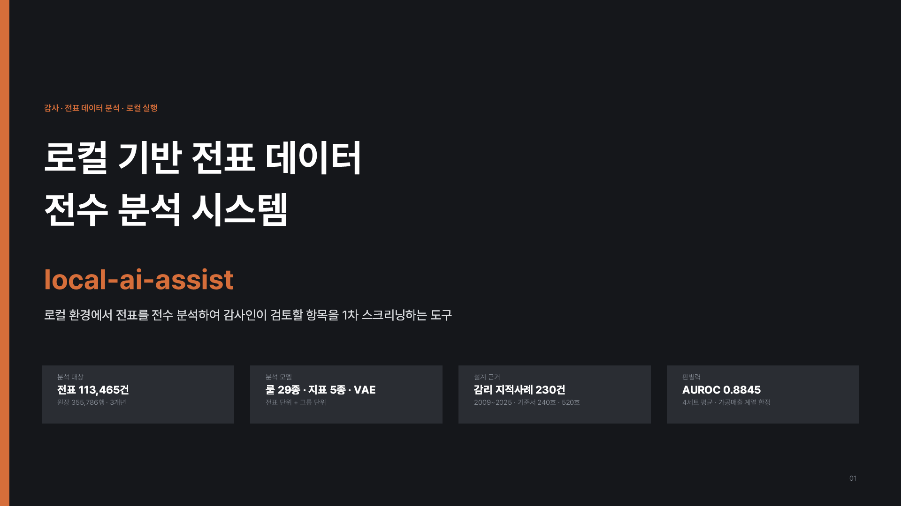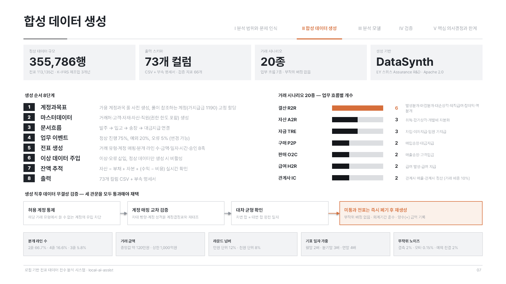</p>
<p align="center">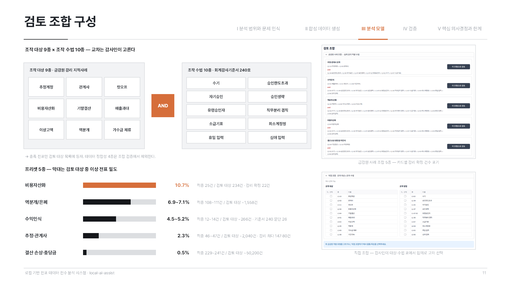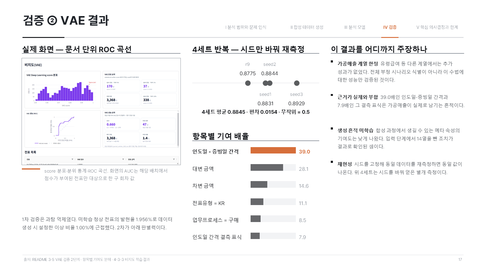</p>

### 2. 문제 인식과 해결 방향

- 문제 인식
  - 생성 후 편집 불가능 : 범용 LLM은 PPT결과물을 이미지 형태로 생성
  - 일관성 보장 어려움 : 프로젝트마다 다른 규격과 템플릿으로 생성
- 해결 방향
  - 편집 가능한 PPT : 파이썬 활용 도형과 텍스트 직접 배치
  - 템플릿 고정 : 내용 생성과 디자인을 분리 → 일관성이 필요한 서식 규칙만 고정

### 3. 핵심 설계


```mermaid
flowchart LR
    IN(["자료<br/>사용자가 정리해둔 문서"])
    FIX["인터뷰<br/>목차, 핵심 내용등을 사용자와 합의"]
    RUN["생성과 검증<br/>파이썬으로 생성 → 기계 검사"]
    OUT(["완성<br/>편집 가능한 pptx"])

    IN --> FIX --> RUN --> OUT
    RUN -.->|사용자가 목업 이미지를 보고 반려| FIX

    classDef step fill:none,stroke:#9aa0a6,stroke-width:1px
    classDef port fill:none,stroke:#5f6368,stroke-width:1.5px
    class FIX,RUN step
    class IN,OUT port
```

#### 3-1. 인터뷰 — 상세 [3-1. 기술 설명 - 계약](#3-1-기술-설명---계약)

| 항목      | 내용                                                                                    |
| --------- | --------------------------------------------------------------------------------------- |
| 도입 배경 | 매 생성마다 변경되는 문서 전체 틀 및 핵심 내용 통제 필요                                |
| 스킬      | [`deck-outline-grill`](.claude/skills/deck-outline-grill/SKILL.md)(자체 생성)           |
| 묻는 것   | 전체 목차 구조화, 개별 슬라이드의 핵심 내용 결정                                        |
| 산출물    | 계약 파일 `_workspace/<프로젝트>/01.5_outline.md` - 후속 단계 일관성 통제 계약으로 적용 |


#### 3-2. 생성 — 상세 [3-2. 기술 설명 - 템플릿](#3-2-기술-설명---템플릿)


| 계층                      | 파일                            | 결정 범위                                      |
| ------------------------- | ------------------------------- | ---------------------------------------------- |
| 공통 하네스 (규격 고정)   | `brand.yaml`                    | 사용 색상, 글꼴, 글 크기,여백 수치             |
|                           | `kit.py`                        | 표지, 목차, 간지, 한글 줄바꿈 규칙             |
|                           | `blocks.py`                     | 시각화 요소 (차트, 표, 텍스트 카드, 단계도 등) |
|                           | `outline.py`                    | 슬라이드 제목, 헤드라인                        |
| 개별 슬라이드 (매번 변동) | `_workspace/<프로젝트>/deck.py` | 개별 슬라이드 생성                             |

#### 3-3. 검증 — 상세 [3-3. 기술 설명 - 기계 검사 22종](#3-3-기술-설명---기계-검사-22종)

| 검증 모듈          | 대조 기준              | 탐지 대상                                            |
| ------------------ | ---------------------- | ---------------------------------------------------- |
| `check_outline.py` | 생성 제목 ↔ 자료 원문  | 원본에 없는 임의 생성 제목                           |
| `check_deck.py`    | 완성 PPT ↔ 계약 규격   | 구조 불일치, 규격 미달 객체 사용 등 물리적 형태 점검 |
| `score_deck.py`    | 완성 PPT ↔ 계약 디자인 | 빈 여백, 낮은 명암 대비, 겹친 도형, 색 남용 등       |
| `render_deck.ps1`  | 완성 PPT ↔ 사용자 검증 | 최종 검수 및 승인/반려                               |

#### 3-4. 목업 이미지 생성

생성된 후보군을 이미지 형태로 제공 → 사용자 선호에 맞게 최종 규격 확정<br>
목업 이미지는 배치만 고르는 단순 스케치 → 빈 내용은 확정 후 채워짐


<p align="center">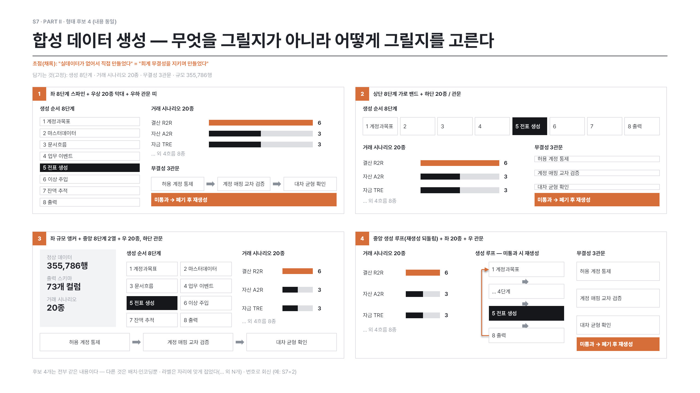</p>

### 4. 최종 산출물 — 19장 자동 렌더링 원본 (수작업 보정 없는 무수정 결과물)

`local-ai-assist` 소개 덱, 5부 구성으로 표지 1, 목차 1, 간지 5, 본문 12

<details>
<summary><b>Ⅰ부 분석 범위와 문제 인식 (펼치기)</b></summary>

<p align="center"></p>
<p align="center"><sub>01 표지, 하단 지표 카드 4장</sub></p>

<p align="center">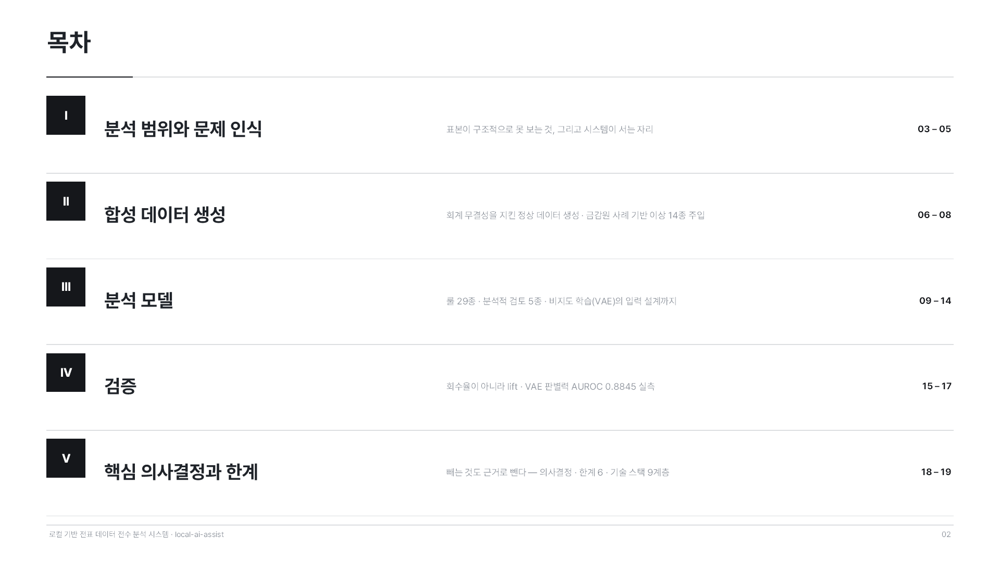</p>
<p align="center"><sub>02 목차, 부마다 한 행</sub></p>

<p align="center">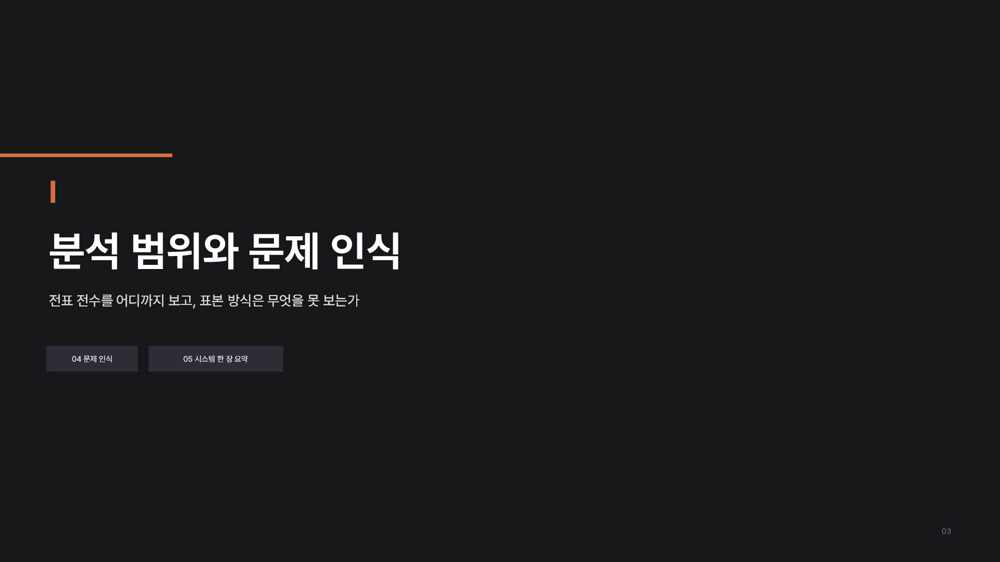</p>
<p align="center"><sub>간지, 그 부에 무엇이 들었는지 칩으로 미리 보인다</sub></p>

<p align="center">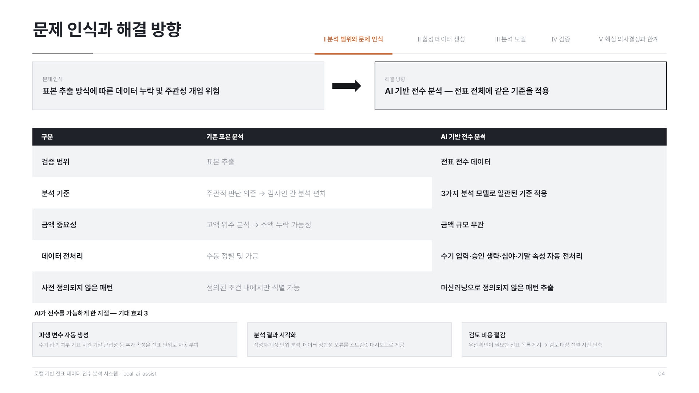</p>
<p align="center"><sub>04, 비교표 형태</sub></p>

<p align="center">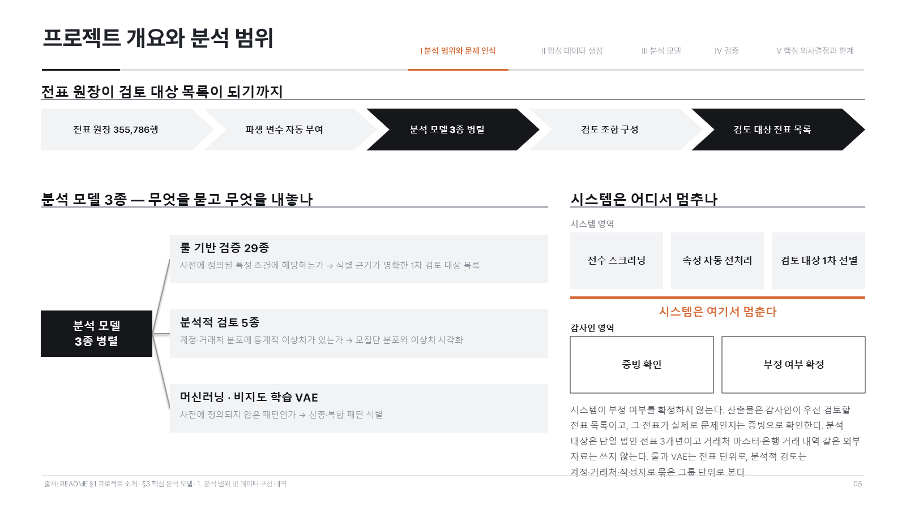</p>
<p align="center"><sub>05, 슬롯 카드 형태</sub></p>

</details>

<details>
<summary><b>Ⅱ부 합성 데이터 생성 (펼치기)</b></summary>

<p align="center">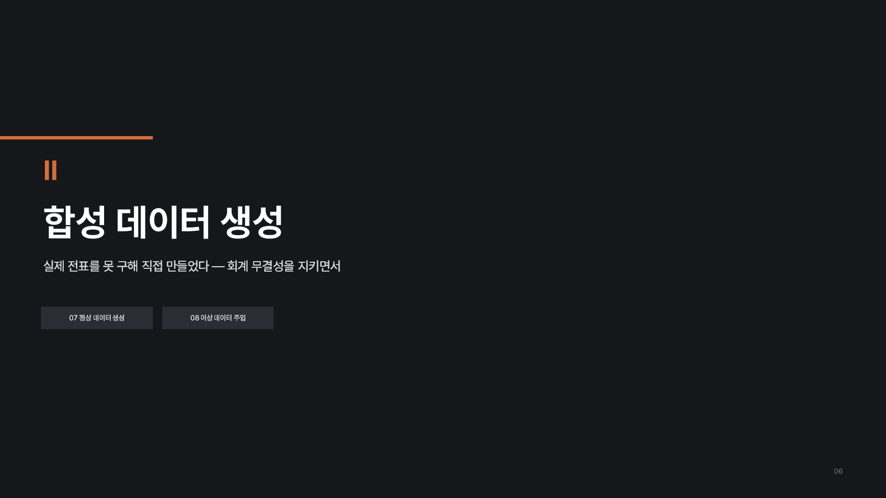</p>

<p align="center"></p>
<p align="center"><sub>07, 단계와 비례 막대와 관문을 한 장에</sub></p>

<p align="center">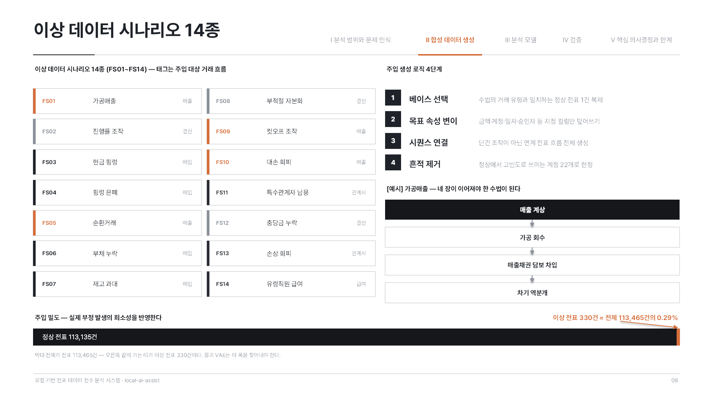</p>
<p align="center"><sub>08, 카드 격자 형태</sub></p>

</details>

<details>
<summary><b>Ⅲ부 분석 모델 (펼치기)</b></summary>

<p align="center">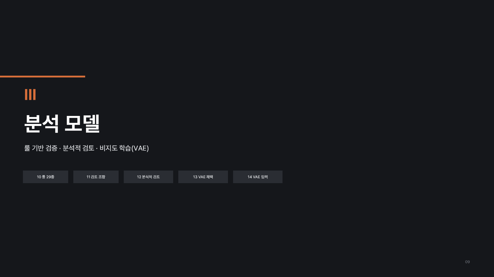</p>

<p align="center">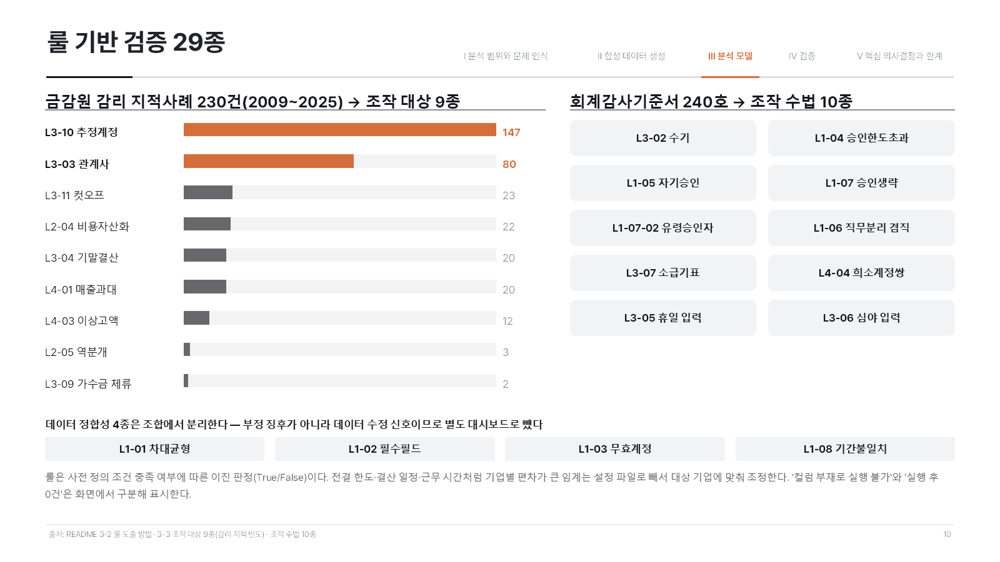</p>
<p align="center"><sub>10, 인과 구도와 비례 막대</sub></p>

<p align="center"></p>
<p align="center"><sub>11, 교차 격자와 화면 캡처</sub></p>

<p align="center">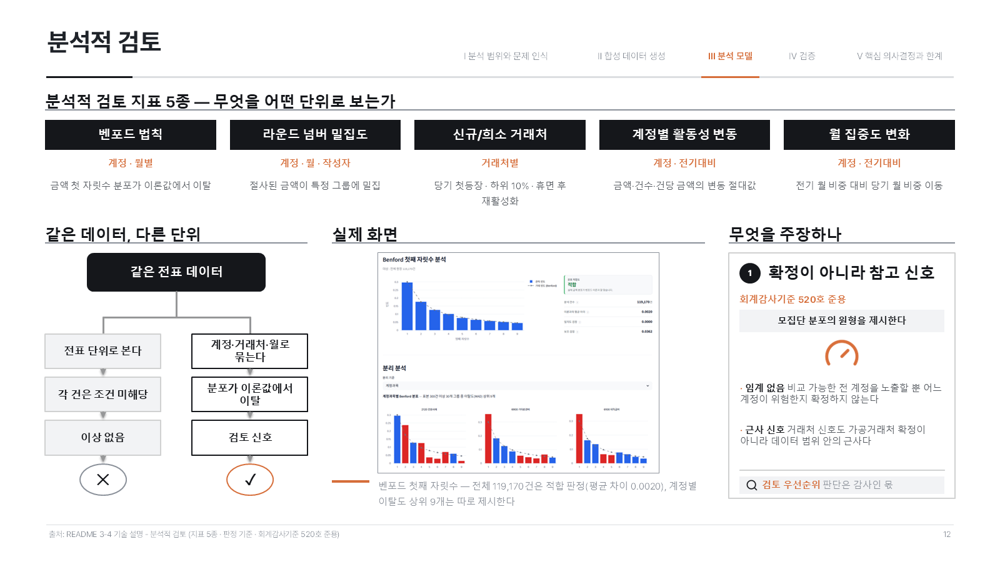</p>
<p align="center"><sub>12, 지표와 화면을 짝지은 형태</sub></p>

<p align="center">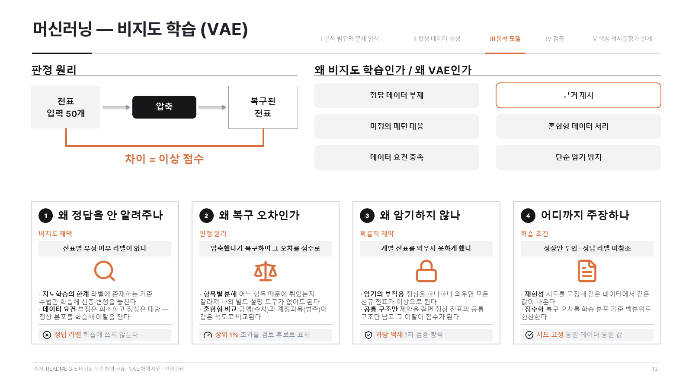</p>
<p align="center"><sub>13, 채택 사유 대조 형태</sub></p>

<p align="center">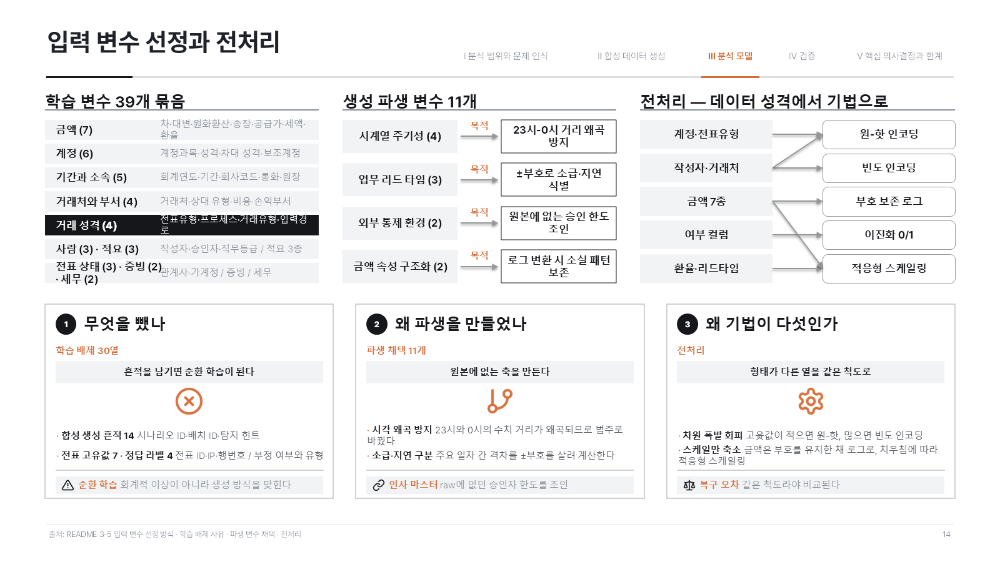</p>
<p align="center"><sub>14, 열 단위 매핑 형태</sub></p>

</details>

<details>
<summary><b>Ⅳ부 검증, Ⅴ부 핵심 의사결정과 한계 (펼치기)</b></summary>

<p align="center">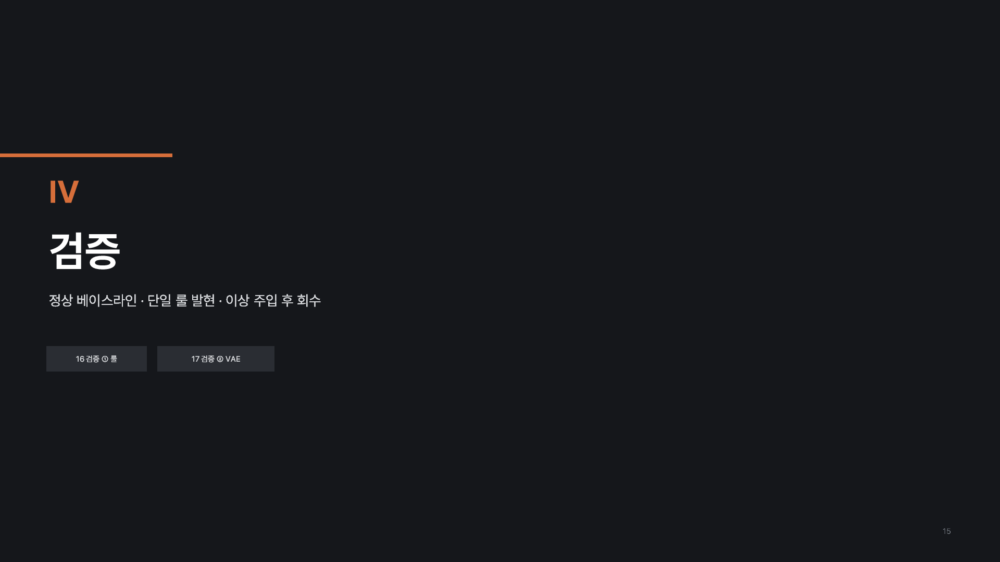</p>

<p align="center">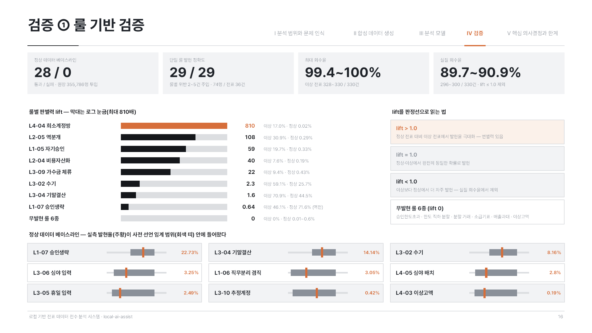</p>
<p align="center"><sub>16, 분포 대조 형태</sub></p>

<p align="center"></p>
<p align="center"><sub>17, 지표와 기여 배율과 화면을 섞은 형태</sub></p>

<p align="center">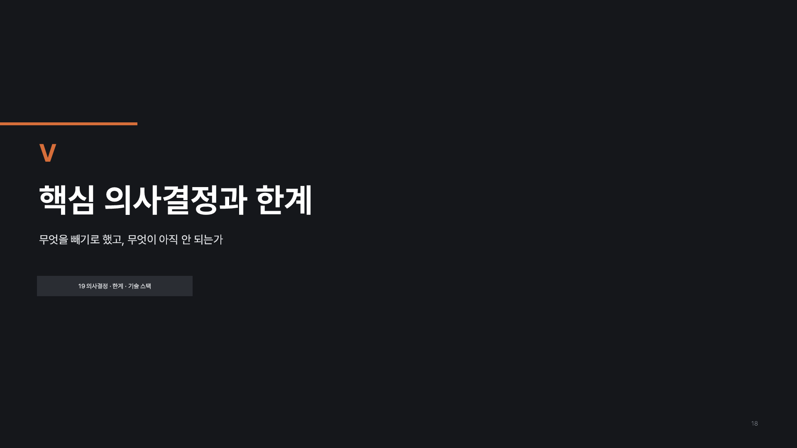</p>

<p align="center">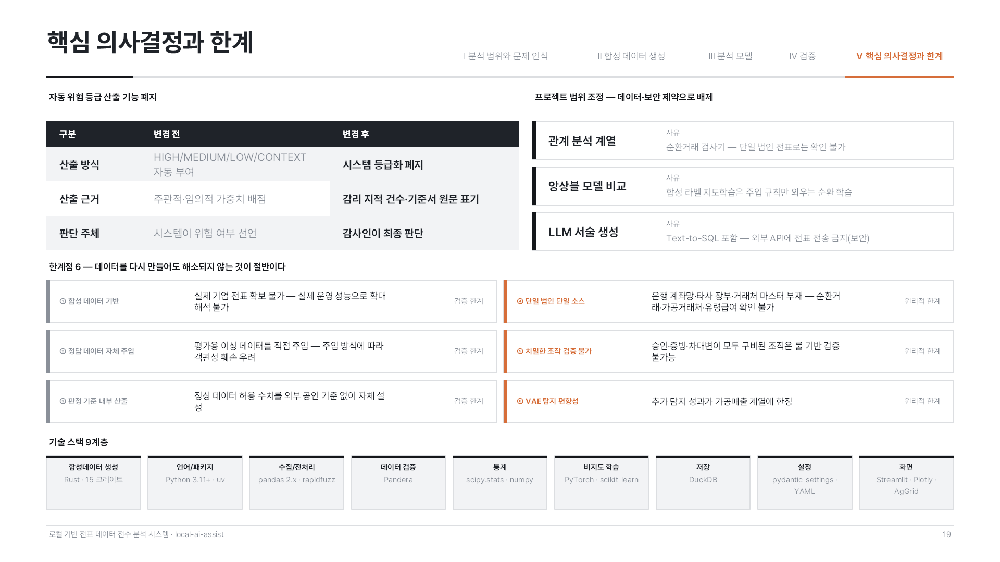</p>
<p align="center"><sub>19, 세 주제를 한 장에 세로로 나눈 형태</sub></p>

</details>

---

## 목차

1. [문제 인식과 접근 비교](#1-문제-인식과-접근-비교)
2. [실증 예시](#2-실증-예시)
3. 기술 설명
   1. [계약](#3-1-기술-설명---계약)
   2. [템플릿](#3-2-기술-설명---템플릿)
   3. [기계 검사 22종](#3-3-기술-설명---기계-검사-22종)
   4. [지도와 덱 상태](#3-4-기술-설명---지도와-덱-상태)
4. [검증](#4-검증)
5. [핵심 의사결정](#5-핵심-의사결정)
6. [한계](#6-한계)
7. [기술 스택](#7-기술-스택)

---

## 1. 문제 인식과 접근 비교

### 소유의 경계

- 핵심 명제 : 토큰이 소유하면 한 곳을 고쳐 전체가 바뀌고, 부품이 소유하면 안 맞는 장에서도 그 형태로 그려짐
- 그래서 가른 것 : 일관성이 필요한 축만 템플릿에 넘기고 나머지는 코드에 남김

### 아키텍처 원칙 5

| #   | 원칙                             | 코드에 어떻게 박혔나                                                   |
| --- | -------------------------------- | ---------------------------------------------------------------------- |
| 1   | 일관성이 필요한 것만 소유        | 토큰 33개가 색, 글꼴, 판형, 임계를 지고 조판과 게이트가 리터럴을 안 씀 |
| 2   | 장 구성은 소유하지 않음          | 흐름도와 관계도를 그리는 도해 부품이 0종, 사각과 커넥터만 제공         |
| 3   | 기계는 통보자이지 판정자가 아님  | 물리와 기하는 하드페일, 표 행 높이와 재료 커버리지는 경고만            |
| 4   | 임계는 리터럴이 아니라 실측 파생 | 밀도 하한 535자는 골든 17장 스냅샷의 가장 성긴 장에서 계산             |
| 5   | 지어내는 것은 입력에서 차단      | 부 이름을 게이트로 뒤에서 잡지 않고 계약에서 읽어옴                    |

- 원칙 3과 4가 같은 뿌리인 이유 : 숫자로 굳히면 그 숫자를 채우는 쪽으로 왜곡됨
- 실측 근거 : 글자 수 하한을 걸었더니 본문 12장 합계로 글자 +2,091, 시각 요소 −39. 막대가 텍스트 목록이 됨

### 통상적 접근 대비 차이

| 관점               | 통상적 접근                  | 이 하네스                                        | 차이가 만드는 효과                                  |
| ------------------ | ---------------------------- | ------------------------------------------------ | --------------------------------------------------- |
| 템플릿의 범위      | 레이아웃 자리표시자까지 소유 | 색, 글꼴, 여백, 페이지 골격 4개만, 도해 부품 0종 | 자리표시자가 없어 장 구성이 굳지 않음               |
| 제목과 부 이름     | 조판 단계에서 결정           | 계약이 재료 헤딩에서 따와 확정                   | 사용자가 안 보는 자리에서 문구가 바뀌지 않음        |
| 게이트의 성격      | 통과와 실패의 판정자         | 물리와 기하만 하드페일, 미적인 것은 경고         | 재료를 부품에 맞춰 휘게 만들지 않음                 |
| 임계의 출처        | 설계자가 정한 리터럴         | 실측 파생, 기준선이 바뀌면 따라 이동             | 추측 선언값 10종 중 9종이 실측과 달랐던 전례를 차단 |
| 현재 상태의 기록   | 사람이 문서로 유지           | 코드에서 추출, 어긋나면 종료코드 1               | 문서가 갱신을 잊고 거짓말하는 경로가 닫힘           |
| 사용자 왕복의 위치 | 완성 후 피드백               | 그리기 전에 후보를 실제 pptx로 그려 선택         | 반려에 방향이 생김, 1안씩 내밀면 별로다로 끝남      |

---

## 2. 실증 예시

`local-ai-assist` 덱 10번 슬라이드 「룰 기반 검증 29종」이 재료에서 게이트까지 통과하는 과정

<p align="center">
  
</p>

1. **재료 읽기**
   - 원문 위치 : 완성본 README 3-2 기술 설명 절
   - 실체 : 감리 지적사례 230건(2009\~2025), 회계감사기준서 240호
   - 수치 : 조작 대상 9종의 지적 빈도 `147 / 80 / 23 / 22 / 20 / 20 / 12 / 3 / 2`, 활성 룰 29종의 주제별 6그룹 `4, 5, 5, 6, 5, 4`
2. **계약 확정**
   - 장 제목 : 룰 29종, 재료 헤딩 뎁스 그대로
   - 헤드라인 : 룰 기반 검증 29종, 슬라이드에 실제로 박히는 한 줄
   - 채록 원문 : "룰 하나하나에 출전이 있다", 사용자 육성 그대로 보존
   - 대조 결과 : 제목 토큰 `{룰, 기반, 검증, 29종}`이 재료 헤딩과 겹침률 임계 0.5를 넘어 통과
3. **형태 후보와 선택**
   - 초점 : 채록이 지목한 "출전이 있다"
   - 고른 형태 : 두 출처에서 두 축으로, 다시 29종으로 갈라지는 인과 구도
4. **조판**
   - 골격 한 줄 : 제목 24포인트, 헤더 밑줄, 좌측 근흑 마디, 푸터, 우측 부 탭 5개
   - 본문 좌표 : 좌상에 출처 박스 2개, 커넥터 2개, 중단에 9행 비례 막대, 하단에 6그룹 카드, 우열에 화면 캡처 3장
   - 막대 규칙 : `147`을 1.0으로 정규화하고 최댓값만 포인트색
5. **렌더 확인 — 판정자는 사용자**
   - 확인 대상 : 렌더 PNG 전장
   - 이 단계에서만 잡히는 것 : 부제가 「실무 관/행」으로 어절 중간에 꺾인 사고, 좌표 게이트는 통과시킴
6. **기계 게이트**
   - 이 장에서 도는 검사 : 우변 초과, 하변 초과, 이미지 판독 폭, 헤드라인 계약 일치, 부 내비 문구와 순서, 강조 대상
   - 게이트 판정 : 19장 전부 통과
   - 검출력 확인 : `s04`의 내비 강조를 일부러 지우자 `부 내비 강조가 0개다`가 즉시 검출됨

---

## 3-1. 기술 설명 - 계약

> **실제 구현**
> - 파서 : [`outline.py`](.claude/skills/pptx-build/scripts/deckkit/outline.py)
> - 재료 대조 : [`check_outline.py`](scripts/check_outline.py)
> - 계약 실물 : `_workspace/local-ai-assist/01.5_outline.md`

### 이 층이 있는 이유

- 실측 문제 : 본문 12장 중 8장의 제목과 부 이름 5개 전부가 조판 단계 창작
- 드러난 사례 : 간지에 「Ⅱ 검증할 데이터」로 적혀 있었으나 재료에 써 둔 뎁스는 「합성 데이터 생성」
- 근본 원인 : 계약에 그 칸이 없어 조판이 알아서 지었고 아무도 대조하지 않음

### 계약 서식 — 장 목록 7열

| 열             | 무엇                           | 누가 읽나             |
| -------------- | ------------------------------ | --------------------- |
| `#`            | 장 번호, `S4` 또는 `4`         | 파서와 게이트         |
| `부`           | 로마자 Ⅰ에서 Ⅴ, 정형 장은 대시 | 부 내비 강조 대조     |
| 장 제목        | 재료 헤딩 그대로               | 재료 대조기           |
| 헤드라인       | 슬라이드에 실제로 박히는 한 줄 | 덱 게이트             |
| 전하고 싶은 것 | 사용자 육성 채록 원문          | 형태 후보 단계의 초점 |
| 재료 출처      | 어느 절에서 왔나               | 사람                  |
| 상태           | 확정 또는 보류                 | 사람                  |

- 별도 표 하나 더 : 부와 간지 표가 **부 내비게이션 문구의 유일한 출처**
- 결합 방식 : 조판은 한 줄로 이 표를 읽고, 게이트는 **같은 함수로** 기대값을 만듦

### 지어내는 것을 막는 두 경로

| 대상    | 막는 방식            | 왜 이 방식인가                                              |
| ------- | -------------------- | ----------------------------------------------------------- |
| 장 제목 | 게이트로 뒤에서 대조 | 장마다 한 곳이라 틀릴 자리가 장 수만큼                      |
| 부 이름 | 계약에서 읽어옴      | 본문 전 장 상단에 5줄이 깔려 틀릴 자리가 장 수 곱하기 부 수 |

- 실측 개선 : 조판 창작 제목 8장에서 0, 부 이름 5개에서 0
- 남는 구멍 : 계약 자체가 틀리면 이 경로로는 못 잡음, 그 방어를 재료 대조기가 짐

### 계약과 재료 대조 규칙

| 단계      | 규칙                                                   |
| --------- | ------------------------------------------------------ |
| 헤딩 수집 | 재료의 1단계에서 4단계 헤딩 전부                       |
| 토큰화    | 숫자와 마침표 제거 후 구분자로 분할, 2글자 이상만 채택 |
| 히트 판정 | 제목 어절이 헤딩 토큰의 접두 또는 피접두면 히트        |
| 판정      | 전 헤딩 중 최대 겹침률이 0.5 미만이면 지어낸 말로 표시 |
| 면제      | 표지, 목차, 간지와 토큰 0개인 제목                     |

- 접두 매칭이 필요한 이유 : 한국어 조사, 계약의 「의사결정과」가 재료 헤딩의 「의사결정」에 붙어야 함
- 안 보는 것 : 수치를 대조하지 않고 제목 문자열만 봄, 그 공백은 [6. 한계](#6-한계)

---

## 3-2. 기술 설명 - 템플릿

> **실제 구현**
> - 토큰 : [`brand.yaml`](.claude/skills/pptx-build/scripts/deckkit/brand.yaml)
> - 원시도구와 골격 : [`kit.py`](.claude/skills/pptx-build/scripts/deckkit/kit.py)
> - 블록 : [`blocks.py`](.claude/skills/pptx-build/scripts/deckkit/blocks.py)

### 토큰 33개

컨셉은 무채색에 포인트 하나, 구조는 근흑이 지고 오렌지는 핵심 수치 전용

| 묶음        | 개수 | 내용                                                    |
| ----------- | ---: | ------------------------------------------------------- |
| 색          |   11 | 잉크, 근흑 2, 구조 2, 포인트 2, 보조와 선과 면과 흰색 4 |
| 글꼴 크기   |    9 | 40, 30, 24, 22, 13.5, 11.5, 10.5, 9, 7.5 포인트         |
| 글꼴명      |    1 | 세 자형에 같은 값을 강제                                |
| 판형        |    6 | 슬라이드 폭과 높이, 여백, 헤더 밑줄, 본문 상단과 하단   |
| 게이트 임계 |    6 | 우변 허용치, 이미지 판독 폭, 아이콘 상한 등             |

- 구조색이 근흑으로 접힌 이유 : 포인트 자리를 오렌지가 독점하게 만들기 위함
- 글꼴 단을 벌려 둔 이유 : 22와 24 사이가 비어 있으면 적당히 큰 글자로 도망갈 자리가 없음
- 소비자는 정확히 2곳 : 조판과 게이트가 같은 파일을 각각 파싱

### 게이트 임계 6 — 값과 근거가 같은 자리

| 키                 |   값 | 실측 근거                                                       |
| ------------------ | ---: | --------------------------------------------------------------- |
| 우변 허용치        | 0.02 | 좋다고 한 10장은 전부 0, 거슬린다 한 2장만 0.14\~0.54인치 초과  |
| 이미지 판독 폭     | 2.40 | 못 보겠다 한 장 1.25\~1.95인치, 좋다 한 장 2.45인치 이상        |
| 아이콘 상한        | 1.00 | 실측 아이콘 0.17\~0.52인치, 이보다 좁으면 판독 하한 대상이 아님 |
| 표 행 높이 경고    | 0.62 | 경고만, 강제로 누르면 긴 셀 텍스트가 잘림                       |
| 재료 커버리지 경고 | 0.70 | 보고값, 실측 무하네스 59.5%에서 하네스 82.2%                    |
| 이미지 채움 하한   | 0.95 | 미만이면 칸을 그림에 맞추도록 권고                              |

- 효과 : 임계를 완화하려 할 때 무엇을 포기하는지가 같은 화면에 있음

### 원시도구

| 함수            | 무엇                                                       |
| --------------- | ---------------------------------------------------------- |
| 텍스트 블록     | 넘침을 추정해 경고하고 차단하지 않음                       |
| 사각            | 그리는 순간 우변 초과를 경고                               |
| 비율 막대       | 값과 비율을 함께 받아 최댓값을 자동 강조                   |
| 화살표와 커넥터 | 두 도형의 상대 위치로 접점을 자동 선택                     |
| 그림            | 칸을 그림에 맞춤, 채움률 미달이면 해결책까지 메시지에 표시 |
| 페이지 골격 4   | 표지, 목차, 간지, 본문 머리띠                              |

#### 한글 조판은 두 조각이 쌍

```python
p._p.get_or_add_pPr().set("eaLnBrk", "0")      # 어절 단위 줄바꿈
for tag in ("a:latin", "a:ea", "a:cs"):        # 세 자형 전부에 글꼴
    el.set("typeface", FONT)
```

- 앞 줄을 빼면 : 파워포인트가 글자 단위로 끊어 고아 글자가 생김
- 뒤 줄을 빼면 : 자형 셋 중 하나만 빠져도 한글이 다른 꼴로 나옴
- 둘 다 코드가 강제 : 조판이 잊을 수 없음

#### 칸을 그림에 맞추는 순서

```python
def image_h(fname, w, caption=False, cap_h=0.24) -> float:
    """폭 w를 다 쓸 때 필요한 칸 높이."""
    return w / image_ar(fname) + (cap_h if caption else 0)
```

- 보통의 순서 : 칸을 정하고 그림을 우겨넣으면 칸의 5%가 빔
- 뒤집은 순서 : 폭만 정하고 높이를 그림에게 물음

#### 도해 부품을 만들지 않는 이유

- 코드 주석 원문 : 흐름도와 관계도를 블록으로 굳히면 안 맞는 내용에도 그 형식으로 그리게 됨
- 이 저장소가 가진 도해 부품 : **0종**

### 부 내비게이션

```
룰 기반 검증 29종      Ⅰ 분석 범위와 문제 인식   Ⅱ 합성 데이터 생성   Ⅲ 분석 모델   Ⅳ 검증   Ⅴ 핵심 의사결정과 한계
━━━━━                                                                ━━━━━━━━━━  ← 밑줄 위 강조 바
```

| 규칙                                       | 왜                                                            |
| ------------------------------------------ | ------------------------------------------------------------- |
| 시작 좌표 고정                             | 장마다 탭이 움직이면 눈이 매번 찾아야 하고 그러면 내비가 아님 |
| 항목 폭은 제 글자만큼, 남는 폭을 균등 분배 | 균등분할하면 짧은 부에 빈칸이 생기고 긴 부가 눌림             |
| 간격이 하한 미만이면 경고                  | 메시지가 조판이 아니라 **계약의** 부 제목을 줄이라고 지목     |
| 강조 바를 밑줄 위에 얹음                   | 좌측 근흑 마디와 같은 선이라 새 요소를 만들지 않음            |
| 도형 이름에 부 로마자를 박음               | 게이트가 이 이름으로 찾음, 조판과 게이트의 유일한 결합점      |
| 간지에는 넣지 않음                         | 간지 자체가 부 표시                                           |

- 가로로 늘어놓은 이유 : 제목 옆 빈 공간을 쓰기 위함, 세로 시안은 7.5포인트 5줄로 공간을 덜 씀
- 파급 효과 : 눈썹 한 줄이 탭으로 대체돼 0.45인치가 비어 머리띠를 통째로 올림, 본문 세로가 2.9% 넓어짐

### 블록 8종

전부 주어진 사각형 안만 그리고 **자기 자리를 모른다**

| 블록        | 소유하는 것                             | 호출자가 정하는 것           |
| ----------- | --------------------------------------- | ---------------------------- |
| 지표 띠     | 가로 균등분할, 3층 위계                 | 자리, 항목, 면 색            |
| 슬롯 카드   | 행은 항목, 칸은 슬롯, 슬롯 구분선       | 슬롯 라벨과 폭 비            |
| 번호 단계   | 자동 번호 배지, 행 높이 자동 계산       | 제목 열 폭, 강조 인덱스      |
| 갈래        | 척추선과 갈래 가지                      | 루트 폭, 잎 간격             |
| 문제와 해결 | 캡션 두 개와 가운데 화살표              | 두 문장과 간격               |
| 비교표      | 머리 높이, 짝수 행 줄무늬, 행 높이 경고 | 라벨 열 비율, 우열 강조 여부 |
| 값 막대     | 최댓값 자동 강조                        | 네 개 열 폭 전부             |
| 카드 격자   | 행 수 자동, 셀 3분할, 접지 않음         | 열 수, 태그와 색 매핑        |

- 형태를 바꾸는 인자는 소수 : 슬롯 라벨, 강조 인덱스, 우열 강조, 열 수와 태그 색뿐
- 나머지 인자는 치수만 변경

---

## 3-3. 기술 설명 - 기계 검사 22종

> **실제 구현**
> - 좌표와 계약 : [`check_deck.py`](.claude/skills/pptx-build/scripts/check_deck.py)
> - 오딧 러너 : [`score_deck.py`](.claude/skills/pptx-build/scripts/score_deck.py)
> - 렌더 : [`render_deck.ps1`](.claude/skills/pptx-build/scripts/render_deck.ps1)

```
 계약과 재료   ──▶  제목이 재료 어휘에서 나왔나                 1종
 덱과 계약     ──▶  헤드라인, 부 내비, 좌표                     9종 하드페일, 보고 1종
 덱 품질       ──▶  오딧, 밀도와 대비와 겹침과 어휘            12종 참고 채점
 렌더 PNG      ──▶  전장 확인, 사용자가 판정                    ★ 진짜 게이트
 진행 상태     ──▶  계약, 상태, pptx, 렌더 장 수 대조          9판정
```

### 덱과 계약 대조 9종

| #   | 검사                | 조건                                                     |
| --- | ------------------- | -------------------------------------------------------- |
| 1   | 우변 초과           | 어중간하게 넘음, 슬라이드 끝까지 흘리는 전폭 배경은 면제 |
| 2   | 하변 초과           | 푸터 영역 침범                                           |
| 3   | 이미지 판독 폭      | 아이콘 상한과 판독 하한 사이에 낀 그림                   |
| 4   | 헤드라인 계약 일치  | 계약 문구가 밑줄 위 텍스트 중에 없음                     |
| 5   | 정형 장 문구 존재   | 표지와 간지 문구가 덱 전체 텍스트에 없음                 |
| 6   | 부 내비 누락        | 계약이 부를 지정한 장에 내비 도형 0개                    |
| 7   | 부 내비 문구와 순서 | 계약이 만든 기대 목록과 리스트 전체 비교                 |
| 8   | 부 내비 강조 개수   | 강조된 내비가 정확히 하나가 아님                         |
| 9   | 부 내비 강조 대상   | 강조된 부가 계약이 그 장에 지정한 부와 다름              |

- 별도 1종 : 재료 커버리지, 반환형이 문자열이라 **종료코드에 영향 없음**
- 보고로 둔 이유 : 19장이 재료 전량을 담을 수 없고 무엇을 담을지는 계약이 정할 일

### 좌표 대신 토큰 파생

```python
# 머리띠 = 헤더 밑줄 위. 좌표를 박지 않고 토큰에서 뽑는다
and Emu(sh.top).inches < FR["rule"]
and not sh.name.startswith("부내비:")
```

- 회귀 실측 : 밑줄을 올린 직후 창을 박아 둔 검사가 제목을 놓쳐 12장 전부 오탐
- 조치 : 창을 토큰 파생으로 바꿔 0건

### 오딧 12종

| 검사 묶음   | 무엇을 잡나                                         |
| ----------- | --------------------------------------------------- |
| 색과 대비   | 포인트색 과다, 판정 색 대비                         |
| 경계와 밀도 | 경계 이탈, 밀도 미달, 상자가 내용보다 큼            |
| 카드 품질   | 밝은 카드에 구조 자식이 0인 밋밋한 카드             |
| 정보량      | 같은 이름에 같은 서명인 재탕, 같은 이름에 다른 채움 |
| 겹침        | 글자 넘침, 텍스트 겹침, 그림이 글자 침범            |
| 덱 단위     | 아이콘 어휘가 통째로 죽었나                         |

- 경계 선언 : 채움은 클래스라 같은 이름이면 같아야 하고, 테두리와 점선은 상태라 달라도 됨
- 하한을 1보다 올리지 않는 이유 : 장별 커버리지 하한을 만들면 카드 4장 써라가 태어난 경로와 같음

### 검사기의 읽기 전용 원칙

- 사고 내용 : 색을 읽으려 접근한 속성이 XML을 생성해 검정 헤어라인 테두리가 붙음
- 조치 : 색 읽기를 전부 XML 읽기 전용으로 전환
- 이 저장소의 유일한 치명 사고이자 구조적으로 닫힌 경로

### 임계의 실측 파생

```python
{'shapes_min': 22, 'frames_min': 11, 'chars_min': 535, 'shapes_floor': 20, 'n_body': 10}
```

- 글자 하한 계산식 : 골든 본문 장 최소 글자 수의 85%
- 도형 수가 아니라 글자 수로 재는 이유 : 도형 수로 재면 밀도 부족을 카드 4장으로 메우는 반사를 유발

### 렌더 확인의 규율

| 축   | 신규 조판       | 수정 라운드                                |
| ---- | --------------- | ------------------------------------------ |
| 단위 | 전 장을 한 번에 | **한 번에 한 장씩**                        |
| 렌더 | 기본 폭 전장    | **고친 장만 두 배 폭**                     |
| 종료 | 전 장 훑고 채점 | 그 장이 끝나기 전에 다음으로 넘어가지 않음 |

- 기본 폭 전장 훑기의 한계 : 카드 안 정렬이 보이지 않음
- 실측 사고 : 게이트 통과와 렌더 확인까지 하고도 사용자가 확대해서야 어긋남을 발견

---

## 3-4. 기술 설명 - 지도와 덱 상태

> **실제 구현**
> - 지도 생성 : [`make_map.py`](scripts/make_map.py)
> - 덱 상태 : [`deck_state.py`](scripts/deck_state.py)
> - 산출물 : [`docs/MAP.md`](docs/MAP.md)

### 왜 손으로 안 쓰나

- 사고 내용 : 한 문서가 스스로 현재 상태의 단일 출처라 선언한 채 이미 폐기된 구조를 6일 동안 설명
- 결과 : 그걸 읽고 답한 것이 계속 어긋났고 원인을 찾는 데 시간이 감
- 명제 : 손으로 쓴 지도는 갱신을 잊는 순간 거짓말이 되고, 그 거짓말은 읽는 쪽을 없어진 곳으로 보냄

### 지도가 뽑는 것

| 뽑는 곳       | 무엇                                          |
| ------------- | --------------------------------------------- |
| 절차 문서     | 파이프라인 코드블록 원문 그대로               |
| 코드 디렉터리 | 구문 분석으로 줄 수와 공개 함수               |
| 오딧 모듈     | 검사 함수를 러너 본문과 대조해 배선 여부 판정 |
| 문서 디렉터리 | 줄 수, 최종 수정 날짜, 죽은 참조              |

### 종료코드 1을 내는 경고 3종

| #   | 조건                                                |
| --- | --------------------------------------------------- |
| 1   | 절차가 부르는 이름이 저장소에 실재하지 않음         |
| 2   | 검사 함수가 어느 러너에도 배선되지 않음             |
| 3   | 역사 문서가 아닌 문서가 존재하지 않는 심볼을 가리킴 |

- 경고 2가 핵심 방어 : 규칙이 있어도 러너에 안 물리면 없는 규칙
- 실증 : 모듈 3개를 지우자 문서 6개가 방금 지운 것을 현재형으로 설명하고 있어 경고 15건

### 덱 진행 상태

지도가 하네스의 현재라면 이 파일은 그 덱의 현재

- 도입 배경 : 계약 다음부터 산출 직전까지 아무것도 파일로 남지 않아 반려가 세션과 함께 사라짐
- 쌓이는 것 : 지금 몇 단계인지, 장마다 어떤 형태를 왜 골랐는지, 무엇을 반려당했고 그걸 하네스로 내릴지
- 종료코드 1 조건 : 반려 표의 하네스 칸이 미정으로 남아 있으면 종료가 막힘

### 획일화 판정

| 임계           |   값 | 뜻                                                       |
| -------------- | ---: | -------------------------------------------------------- |
| 같은 조합 상한 |    2 | 완전히 같은 조합이 이 수를 넘으면 형태가 아니라 틀       |
| 한 부품 점유율 | 0.60 | 한 부품이 본문 장의 이 비율을 넘으면 그 부품이 덱을 지배 |

- 임계 근거 : 완성본 본문 12장에서 조합 12종, 오탐 0으로 맞춘 값
- 잡으려는 실패 : 전 장이 같은 형식, 36장이 동일한 4카드
- 안전장치 : 본문 표본이 4장 미만이면 판정 자체를 하지 않음

---

## 4. 검증

### 검증 로그

| #   | 항목            | 방법                           | 결과                        |
| --- | --------------- | ------------------------------ | --------------------------- |
| 1   | 덱 게이트       | 완성본에 계약을 물려 실행      | **19장 결함 0건**           |
| 2   | 계약과 재료     | 완성본 계약과 재료 문서 대조   | 제목 17개, 재료 밖 **0건**  |
| 3   | 지도            | 생성기 실행                    | 경고 **0건**                |
| 4   | 지도 동기성     | 재생성 후 출력 대조            | 바이트 동일                 |
| 5   | 부 내비 도형 수 | 본문 12장 전수                 | **60개**, 계약 부 수와 일치 |
| 6   | 게이트 검출력   | 내비 강조를 지우고 재실행      | 즉시 검출                   |
| 7   | 오딧 배선       | 검사 함수의 러너 도달 확인     | **12/12**                   |
| 8   | 밀도 밴드 파생  | 밴드 계산 함수 실행            | 글자 하한 535자             |
| 9   | 전수 정독       | 분모를 스크립트로 고정 후 대조 | **58/58**                   |

### 형태 변동성 측정

같은 계약, 같은 재료, 같은 프롬프트로 두 장을 각 3회 생성

- 통제 조건 : 매 회차가 새 컨텍스트, 기존 답과 다른 회차와 골든을 못 열게 차단
- 고정한 것 : 경로와 판형과 저장을 뼈대로 박아 보일러플레이트 차이가 변동으로 안 잡히게 함

| 측정      | 07장 3회              | 10장 3회        |
| --------- | --------------------- | --------------- |
| 도형      | 109\~111, 변동계수 1% | 142\~188, 13%   |
| 시각 요소 | 42\~47, 5%            | 57\~92, **22%** |
| 글자      | 774\~866, 5%          | 648\~852, 11%   |
| 블록 조합 | 1종                   | 2종             |
| 게이트    | 3회 전부 결함 0       | 3회 전부 결함 0 |

10장의 「29종」이 세 번 다르게 인코딩된 실물

<p align="center">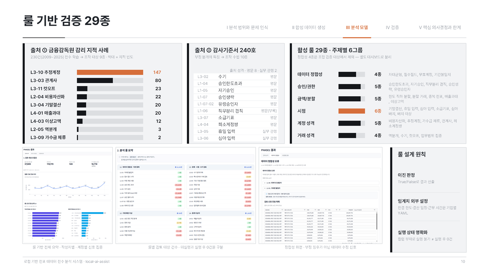</p>
<p align="center"><sub>1회차, 그룹별 값 막대</sub></p>

<p align="center">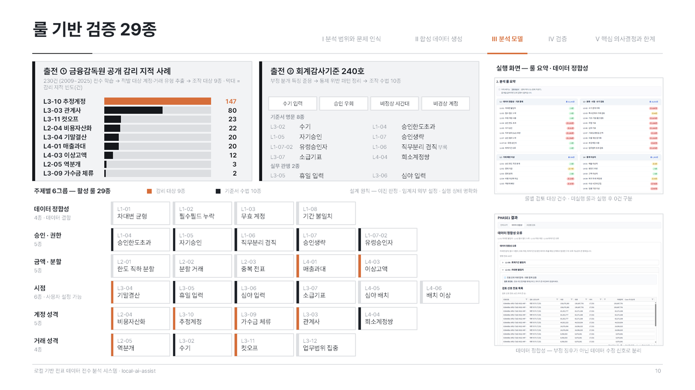</p>
<p align="center"><sub>2회차, 29칸 전수 격자</sub></p>

<p align="center">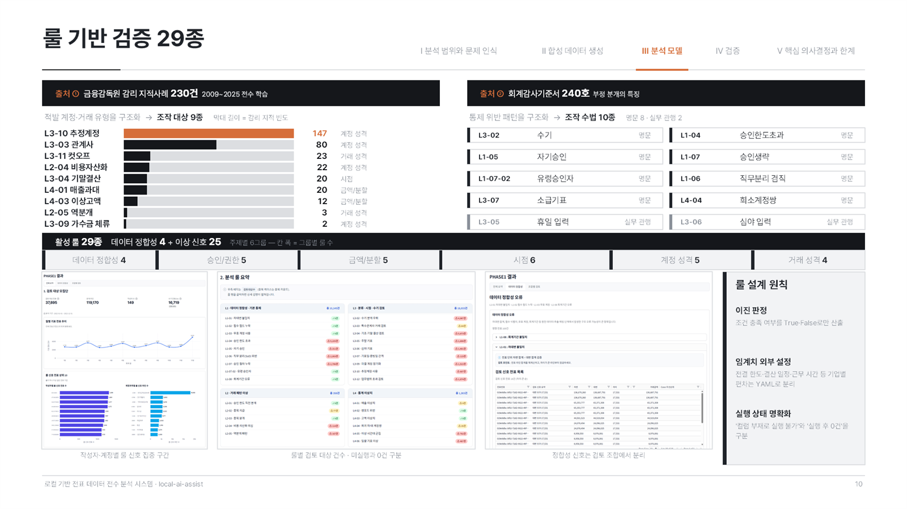</p>
<p align="center"><sub>3회차, 폭 비례 6분할 띠</sub></p>

- 변동의 크기를 정하는 것은 하네스가 아니라 재료
  - 07장이 수렴한 이유 : 순서 8단계와 개수 7종이 재료에 박혀 있어 3회가 같은 구획으로 모임
  - 10장이 갈린 이유 : 29종이 순서 없는 집합이라 인코딩 선택지가 넓음
  - 3회 전부 동일했던 자리 : 지적 빈도 막대, 재료에 크기가 이미 있는 자리
- 수치는 흔들리지 않음 : 3회 전부 같은 값, 지어낸 수치 0
- 계약의 어긋남을 3회가 독립적으로 검출 : 계약은 시나리오 20종인데 재료가 24종으로 갱신돼 있었고 세 회차 모두 재료를 따르고 보고

### 도구 하나를 지운 전후 대조

프롬프트를 글자 단위로 같게 두고 **구획 부품 하나만 삭제**한 뒤 07장을 다시 3회 생성

| 회차          | 도형 | 시각 |    글자 | 커넥터 | 본문을 덮은 큰 단색 면 |
| ------------- | ---: | ---: | ------: | -----: | ---------------------: |
| 완성본        |  111 |   42 |     846 |      3 |                 **0%** |
| 삭제 전 1회차 |  109 |   44 |     866 |      6 |                **94%** |
| 삭제 전 2회차 |  111 |   42 |     862 |      4 |                    93% |
| 삭제 전 3회차 |  111 |   47 |     774 |      4 |                    86% |
| 삭제 후 1회차 |  144 |   62 | **997** |      9 |                     6% |
| 삭제 후 2회차 |  151 |   62 | **998** |      1 |                 **0%** |
| 삭제 후 3회차 |  114 |   48 |     737 |      5 |                 **0%** |

- 관찰 : 빈 자리가 허전해지지 않고 내용으로 참
- 새로 나온 인코딩 : 분개 라인 수 비율 막대, 기표 일자 가중 막대, 8단계를 가로 체인으로 눕히고 안 도는 단계만 회색으로 끔
- 정직한 결론 : **3회가 다 오르지는 않음**, 2회 상승에 1회 제자리

### 이 하네스가 재현하지 못하는 것

- 1회차 산출물은 완성본에 못 미침 : 인과 화살표가 완성본 2\~3개 대비 0개, 도형당 글자가 8.7자 대비 4.5자
- 그 격차를 메우는 것 : 사용자 왕복
- 그 왕복을 없애려던 시도 : 이 프로젝트가 한 번 폐기한 경로

---

## 5. 핵심 의사결정

| #   | 결정                                  | 검토한 대안                        | 채택 이유                                                            |
| --- | ------------------------------------- | ---------------------------------- | -------------------------------------------------------------------- |
| 1   | 도해 부품을 만들지 않음               | 흐름도와 관계도 블록 제공          | 부품이 장 구성을 정하면 안 맞는 내용에도 그 형식으로 그림            |
| 2   | 구획 부품을 삭제하고 후계자를 안 만듦 | 기본값만 끄기, 면 없는 자리 배분기 | 배분기도 결국 칸이고 칸이 있으면 재료를 칸에 맞춰 휨                 |
| 3   | 글자 수 하한을 제거                   | 하한 유지에 시각 하한 추가         | 하한이 글자 +2,091과 시각 −39를 유도                                 |
| 4   | 재료 커버리지를 보고로 둠             | 하드페일 임계 적용                 | 19장이 재료 전량을 담을 수 없고 무엇을 담을지는 계약이 결정          |
| 5   | 부 이름을 계약에서 읽어옴             | 게이트로 대조만                    | 본문 전 장에 5줄이 깔려 옮겨 적으면 장 수 곱하기 부 수만큼 틀릴 자리 |
| 6   | 제목을 계약에서 확정                  | 조판이 다듬게 두기                 | 사용자가 안 보는 자리에서 제목이 바뀌면 그건 계약이 아님             |
| 7   | 부 내비를 가로 탭으로                 | 세로 5줄로 우상단에 배치           | 제목 옆 빈 공간을 씀, 세로는 7.5포인트였고 가로는 9포인트로 확대     |
| 8   | 부 내비 시작 좌표를 고정              | 내용 폭에 따라 우변 정렬           | 장마다 탭이 움직이면 눈이 매번 찾아야 함                             |
| 9   | 헤더 밑줄을 위로 올림                 | 빈 자리에 다른 요소 채우기         | 눈썹이 탭으로 대체돼 비었고, 채우는 대신 줄여 본문이 2.9% 넓어짐     |
| 10  | 게이트 창을 토큰 파생으로             | 창 좌표를 새 값으로 갱신           | 밑줄을 올리자 박아둔 창이 제목을 놓쳐 12장 오탐                      |
| 11  | 밀도와 정렬을 검사하지 않음           | 임계를 찾아 배선                   | 실측상 좋고 나쁨이 안 갈렸고 정렬은 **반대로** 갈림                  |
| 12  | 배치 판단 에이전트를 제거             | 유지하고 임무 보강                 | 결함을 어디에 내릴지는 어차피 사용자 승인이 필요                     |

### 부품이 장 구성을 정하지 못하게 한 결정 — 근거

- 실측 대비 : 완성본 19장이 구획 부품을 **0회** 호출, 계약만 받은 새 컨텍스트는 **6회 중 6회** 호출
- 원인 : 기본값이 면과 선을 함께 켜 두어 부르는 순간 회색 면이 딸려 옴
- 결과 : 본문 면적의 83\~94%가 회색 덩어리, 완성본의 같은 수치는 0%
- 일반화 : **기본값이 장 구성을 정한다**, 규칙이 아니라 기본값이 결과를 만듦

---

## 6. 한계

### 배선 공백

| #   | 한계                           | 실측                                                     |
| --- | ------------------------------ | -------------------------------------------------------- |
| 1   | **프로젝트 훅 0개**            | 설정 파일이 비어 있어 모든 게이트가 수동 실행            |
| 2   | 덱 게이트가 절차에 안 물림     | 파이프라인 문서와 지도 실재표 어디에도 없음              |
| 3   | 재료 대조기가 절차에 안 물림   | 위와 같음                                                |
| 4   | 아카이브 참조 검사기가 부패    | 화이트리스트가 라인번호 하드코딩이라 줄이 밀려 무효화    |
| 5   | 차트 모듈 **1,204줄 미배선**   | 구현은 완성됐으나 호출자 0, 지도 범위 밖이라 경고도 없음 |
| 6   | 구 조판 모듈의 대부분이 미배선 | 살아있는 코드 기준 7함수 중 1개만 도달                   |
| 7   | 래칫 보고 기능 미배선          | 기존 빚을 기준선으로 박는 개념이 코드로만 남음           |

### 검사 자체의 공백

| #   | 한계                    | 실측                                                             |
| --- | ----------------------- | ---------------------------------------------------------------- |
| 8   | 죽은 인자               | 파싱만 되고 검사 본문이 읽지 않음                                |
| 9   | 전폭 배경 면제 비대칭   | 게이트에는 있고 조판 경고에는 없어 같은 도형의 판정이 갈림       |
| 10  | 구판 계약 무음 통과     | 부 표와 헤드라인 열이 없으면 검사 4에서 9가 통째로 스킵          |
| 11  | 수치 대조 없음          | 재료 대조기는 제목만 봄, 계약과 재료의 수치 어긋남은 사람이 발견 |
| 12  | 어절 중간 줄바꿈 미검출 | 좌표 게이트는 상자 밖만 봄, 렌더에서야 발견                      |

### 문서와 자산의 공백

| #   | 한계                              | 실측                                                       |
| --- | --------------------------------- | ---------------------------------------------------------- |
| 13  | 지도의 분모가 하네스 전체가 아님  | 코드 디렉터리 1곳만 보고 이 파일도 검사 범위 밖            |
| 14  | 브랜드 토큰 파일이 **2개**        | 값은 현재 일치하나 동기화하는 기계가 없음                  |
| 15  | 골든덱이 자기 게이트를 못 넘음    | 고정 기준선이 오딧 8건 실패, 프레임 기본값 불일치          |
| 16  | 완성본 본문에 토큰 밖 파생 색 7종 | 덱 전용 조판 코드가 토큰을 섞어 만든 값, 템플릿 골격은 0건 |
| 17  | 완성본 반려 2건이 미정 상태       | 하네스로 내릴지 안 정해 진행 상태 대조가 종료코드 1        |

### 자동 강제가 없는 이유

- 배경 : 훅이 메인 대화가 직접 만드는 경로 자체를 차단해 걷어냄
- 트레이드오프 : 강제를 되살리면 그 문제가 같이 돌아옴
- 현재 상태 : 게이트를 안 돌리고 끝내는 것을 막는 장치가 없음

---

## 7. 기술 스택

| 레이어            | 기술                   | 비고                                            |
| ----------------- | ---------------------- | ----------------------------------------------- |
| 런타임            | Python 3.13 고정       | 버전 파일과 프로젝트 설정 양쪽에 선언           |
| 패키지와 가상환경 | uv, 잠금 파일          | 재현 가능, 별도 활성화 없이 실행                |
| 조판              | python-pptx            | 슬라이드를 파이썬으로 직접 그림, 빌더 경로 없음 |
| 토큰              | PyYAML                 | 브랜드 토큰 33개                                |
| 차트              | matplotlib             | 구현 완료, **현재 미배선**                      |
| 렌더              | 파워포인트 COM, 파워셸 | 전역 뮤텍스로 직렬화, 높이는 판형에서 파생      |
| 검사              | lxml                   | 색 읽기는 반드시 읽기 전용                      |
| 개발              | ruff, pypdfium2        | 줄 길이 100자                                   |

- 라이브러리가 아니라 스크립트 모음 : 빌드 백엔드와 엔트리포인트를 선언하지 않음

---

## 더 읽을 곳

| 문서                                     | 무엇                                                   |
| ---------------------------------------- | ------------------------------------------------------ |
| [`docs/MAP.md`](docs/MAP.md)             | **지금 어떻게 도나의 유일한 권위**, 전부 코드에서 추출 |
| [`FINAL-REPORT/`](FINAL-REPORT)          | 전수 기반 최종 보고서 11장, 사고 12건과 한계 17건      |
| [`CLAUDE.md`](CLAUDE.md)                 | 작업 모드 판별과 하네스 변경 경계                      |
| [`docs/CHANGELOG.md`](docs/CHANGELOG.md) | 하네스 변경의 전체 이력과 근거                         |

---

## 빠른 실행

```bash
uv sync                                                      # Python 3.13 · .venv 생성

uv run python scripts/check_outline.py <계약.md> <재료.md>    # 제목이 자료에서 나왔나
uv run python .claude/skills/pptx-build/scripts/check_deck.py <deck.pptx> --outline=<계약.md>
uv run python .claude/skills/pptx-build/scripts/score_deck.py <deck.pptx>
pwsh .claude/skills/pptx-build/scripts/render_deck.ps1 -Pptx <deck.pptx> -OutDir <폴더>
```

- 렌더는 파워포인트 COM을 쓴다 — 윈도우와 파워포인트가 있어야 돈다
- 지금 무엇이 살아 있는지는 `uv run python scripts/make_map.py`
