# pptmaker — 규격화된 PPT 렌더링 도구


---

## 개요

### 1. 프로젝트 소개
**규격화된 서식으로 내용에 맞춰 슬라이드를 생성하는 파이썬 PPT 렌더링 도구**
> **완성본 예시** : [`local-ai-assist`](https://github.com/ghdtjrgns321-creator/local-ai-journal-assist) 소개 덱 19장 ([전장 보기](#5-최종-산출물--19장-자동-렌더링-원본-수동-편집-없는-자동-생성-원본)), **수동 편집 없는 자동 생성 원본**
<p align="center"></p>
<p align="center"></p>

### 2. 문제 인식과 해결 방향

- 문제 인식
  - 생성 후 편집 불가능 : 범용 LLM은 PPT결과물을 이미지 형태로 생성
  - 일관성 보장 어려움 : 프로젝트마다 다른 규격과 템플릿으로 생성
- 해결 방향
  - 편집 가능한 PPT : 파이썬 활용 도형과 텍스트 직접 배치
  - 템플릿 고정 : 내용 생성과 디자인을 분리 → 일관성이 필요한 서식 규칙만 고정

### 3. 핵심 설계

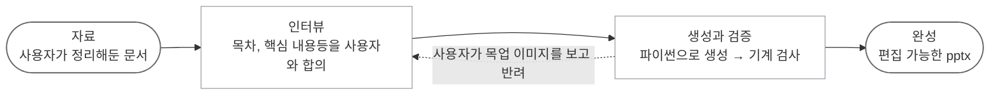

#### 3-1. 인터뷰 — 상세 [3-1. 기술 설명 - 인터뷰 및 계약](#3-1-기술-설명---인터뷰-및-계약)

| 항목      | 내용                                                                                    |
| --------- | --------------------------------------------------------------------------------------- |
| 도입 배경 | 매 생성마다 변경되는 문서 전체 틀 및 핵심 내용 통제 필요                                |
| 스킬      | [`deck-outline-grill`](.claude/skills/deck-outline-grill/SKILL.md)(자체 생성)           |
| 묻는 것   | 전체 목차 구조화, 개별 슬라이드의 핵심 내용 결정                                        |
| 산출물    | 계약 파일 `_workspace/<프로젝트>/01.5_outline.md` - 후속 단계 일관성 통제 계약으로 적용 |


#### 3-2. 생성 — 상세 [3-2. 기술 설명 - 템플릿 구성](#3-2-기술-설명---템플릿-구성)


| 계층                      | 파일                            | 결정 범위                                      |
| ------------------------- | ------------------------------- | ---------------------------------------------- |
| 공통 하네스 (규격 고정)   | `brand.yaml`                    | 사용 색상, 글꼴, 글 크기,여백 수치             |
|                           | `kit.py`                        | 표지, 목차, 간지, 한글 줄바꿈 규칙             |
|                           | `blocks.py`                     | 시각화 요소 (차트, 표, 텍스트 카드, 단계도 등) |
|                           | `outline.py`                    | 슬라이드 제목, 헤드라인                        |
| 개별 슬라이드 (매번 변동) | `_workspace/<프로젝트>/deck.py` | 개별 슬라이드 생성                             |

#### 3-3. 검증 — 상세 [3-3. 기술 설명 - 기계 검사 22종](#3-3-기술-설명---기계-검사-22종)

| 검증 모듈          | 대조 기준              | 탐지 대상                                            |
| ------------------ | ---------------------- | ---------------------------------------------------- |
| `check_outline.py` | 생성 제목 ↔ 자료 원문  | 원본에 없는 임의 생성 제목                           |
| `check_deck.py`    | 완성 PPT ↔ 계약 규격   | 구조 불일치, 규격 미달 객체 사용 등 물리적 형태 점검 |
| `score_deck.py`    | 완성 PPT ↔ 계약 디자인 | 빈 여백, 낮은 명암 대비, 겹친 도형, 색 남용 등       |
| `render_deck.ps1`  | 완성 PPT ↔ 사용자 검증 | 최종 검수 및 승인/반려                               |

#### 3-4. 목업 이미지 생성

생성된 후보군을 이미지 형태로 제공 → 사용자 선호에 맞게 최종 규격 확정<br>
목업 이미지는 배치만 고르는 단순 스케치 → 빈 내용은 확정 후 채워짐


<p align="center"></p>

### 4. 렌더링 변동성 검증

동일 계약 및 원천 데이터를 기반으로 1장의 렌더링을 3회 반복 수행<br>
목업 이미지 생성 단계 생략 후 즉시 생성분

<p align="center">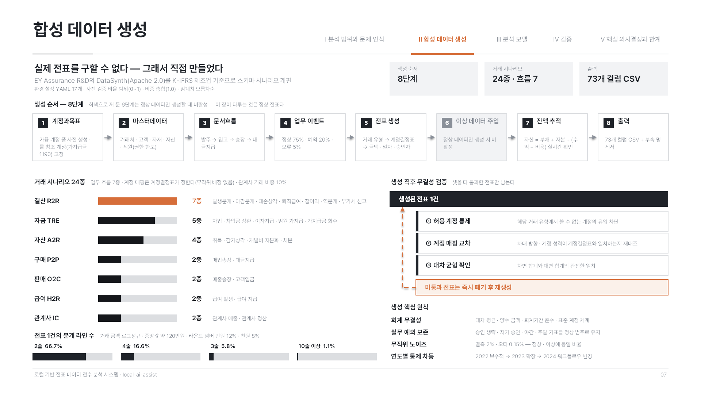</p>
<p align="center"><sub>1회차</sub></p>

<p align="center">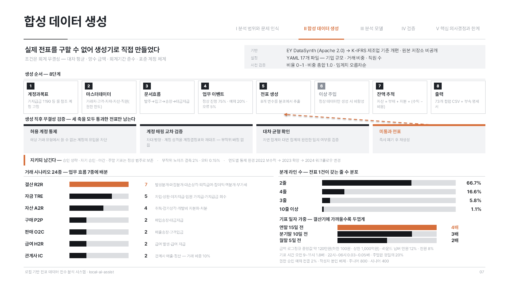</p>
<p align="center"><sub>2회차</sub></p>

<p align="center">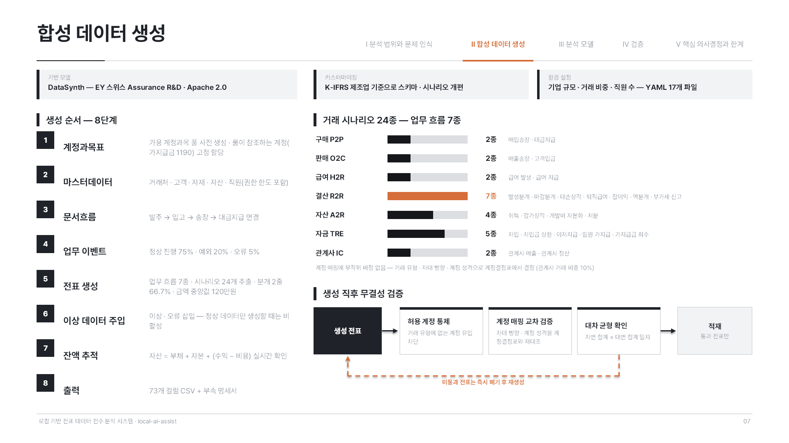</p>
<p align="center"><sub>3회차</sub></p>


### 5. 최종 산출물 — 19장 자동 렌더링 원본 (수동 편집 없는 자동 생성 원본)

`local-ai-assist` 소개 덱, 5부 구성으로 표지 1, 목차 1, 간지 5, 본문 12

<details>
<summary><b>Ⅰ부 분석 범위와 문제 인식 (펼치기)</b></summary>

<p align="center"></p>
<p align="center"><sub>01 표지, 하단 지표 카드 4장</sub></p>

<p align="center"></p>
<p align="center"><sub>02 목차, 부마다 한 행</sub></p>

<p align="center"></p>
<p align="center"><sub>간지, 그 부에 무엇이 들었는지 칩으로 미리 보인다</sub></p>

<p align="center"></p>
<p align="center"><sub>04, 비교표 형태</sub></p>

<p align="center"></p>
<p align="center"><sub>05, 슬롯 카드 형태</sub></p>

</details>

<details>
<summary><b>Ⅱ부 합성 데이터 생성 (펼치기)</b></summary>

<p align="center"></p>

<p align="center"></p>
<p align="center"><sub>07, 단계와 비례 막대와 관문을 한 장에</sub></p>

<p align="center"></p>
<p align="center"><sub>08, 카드 격자 형태</sub></p>

</details>

<details>
<summary><b>Ⅲ부 분석 모델 (펼치기)</b></summary>

<p align="center"></p>

<p align="center"></p>
<p align="center"><sub>10, 인과 구도와 비례 막대</sub></p>

<p align="center"></p>
<p align="center"><sub>11, 교차 격자와 화면 캡처</sub></p>

<p align="center"></p>
<p align="center"><sub>12, 지표와 화면을 짝지은 형태</sub></p>

<p align="center"></p>
<p align="center"><sub>13, 채택 사유 대조 형태</sub></p>

<p align="center"></p>
<p align="center"><sub>14, 열 단위 매핑 형태</sub></p>

</details>

<details>
<summary><b>Ⅳ부 검증, Ⅴ부 핵심 의사결정과 한계 (펼치기)</b></summary>

<p align="center"></p>

<p align="center"></p>
<p align="center"><sub>16, 분포 대조 형태</sub></p>

<p align="center"></p>
<p align="center"><sub>17, 지표와 기여 배율과 화면을 섞은 형태</sub></p>

<p align="center"></p>

<p align="center"></p>
<p align="center"><sub>19, 세 주제를 한 장에 세로로 나눈 형태</sub></p>

</details>

---

## 목차

1. [설계 원칙](#1-설계-원칙)
2. [실증 예시](#2-실증-예시)
3. 기술 설명
   1. [인터뷰 및 계약](#3-1-기술-설명---인터뷰-및-계약)
   2. [템플릿 구성](#3-2-기술-설명---템플릿-구성)
   3. [기계 검사 22종](#3-3-기술-설명---기계-검사-22종)
4. [검증](#4-검증)
5. [핵심 의사결정](#5-핵심-의사결정)
6. [한계](#6-한계)
7. [기술 스택](#7-기술-스택)

---

## 1. 설계 원칙

### 서식 통제와 동적 레이아웃의 역할 분리

| 통제 계층     | 생성 대상                                                                    |
| ------------- | ---------------------------------------------------------------------------- |
| 공통 하네스   | 슬라이드 전체 크기, 색, 글꼴, 헤더 밑줄 위치, 목차 표시 띠, 한글 줄바꿈 규칙 |
| 개별 슬라이드 | 화면을 몇 칸으로 나눌지, 어떤 수치를 어떤 그림으로 나타낼지 등               |

- 역할 분리 이유 : 레이아웃 구조와 배치 좌표를 공통 템플릿으로 강제 → 텍스트의 성격과 분량에 맞지 않는 획일화된 틀에 내용을 억지로 끼워 넣는 현상 다수 발생
- 배제 원칙 : 위 이유에 따라 완성형 도식화 템플릿은 하네스 배제

---

## 2. 실증 예시

`local-ai-assist` 프로젝트를 ppt로 생성하기 까지 실제 진행 기록

### 1. 원천 자료 지정

README.md 문서를 원천 자료로 선택<br>
- 계층 구조 : 뎁스 구조가 논리적으로 이미 분할되어 있음
- 시각 데이터 : ASCII, Mermaid 다이어그램, 스크린샷 등 시각화 요소 내재
- 콘텐츠 정합성: 핵심 메시지와 목차 구성이 기획 단계에서 이미 구조화된 상태임

### 2. 인터뷰

- 전체 프레임 구성 : 원천 자료 목차구성 사용 시 **내용이 과다해지는 5장을 분할** → 5부 구성 + 본문 12장 확정
- 타이틀 보정 : 원문의 제목들을 우선 시안으로 추출 보정<br>ex) 「3-2. 룰 기반 검증」 → 『룰 기반 검증 29종』
- 핵심 메시지 매핑 : 각 슬라이드의 핵심 전달 요지 채록
- 계약서 산출물 : `_workspace/local-ai-assist/01.5_outline.md`

### 3. 목업 이미지 확인 및 확정

- 목업 렌더 이미지 제시 → 사용자가 `S4=1, S7=3, S10=차트는1, 관계도는3 조합` 형식으로 회신

### 4. 생성

| 통제 계층     | 생성 대상                                                                    |
| ------------- | ---------------------------------------------------------------------------- |
| 공통 하네스   | 슬라이드 전체 크기, 색, 글꼴, 헤더 밑줄 위치, 목차 표시 띠, 한글 줄바꿈 규칙 |
| 개별 슬라이드 | 화면을 몇 칸으로 나눌지, 어떤 수치를 어떤 그림으로 나타낼지 등               |

- 총 1,668 라인 규모 (19장 기준, 슬라이드 단일 장당 평균 88 라인의 개별 동적 생성 로직 할당)
- 레이아웃 다형성 강제: 각 장에 독립된 시각화 조합 적용 (동일 조합 3회 초과 반복 시 자동 차단)
- 동적 도식화 : 흐름도, 관계도 → 완성된 틀 없이 사각형과 선으로 매번 새로 생성하여 내용에 맞는 도식화 적용

### 5. 검증

| 검증 항목               | 검증 방법                            | 검증 결                                                                       |
| ----------------------- | ------------------------------------ | ----------------------------------------------------------------------------- |
| 계약과 정합성 대조      | 계약 사항 ↔ 산출물 정합성 검사 실행  | 19장 결함 0건, 계약 명세와 전체 일치                                          |
| 로직 무결성 테스트      | 슬라이드 내 객체를 임의 훼손 후 실행 | 즉각 탐지                                                                     |
| 기계 검증 사각지대 식별 | 이미지로 출력하여 시각 검수          | 타이포그래피 결함 식별 (예: 「실무 관/행」 등 의미 단위 중간 줄바꿈 현상)     |
| 최종 사용자 검수        | 사용자가 이미지를 보고 반려          | 4번 장 "아래 공간이 남는다", 11번 장 "라벨은 9종과 10종인데 그림은 7개와 8개" |

### 6. 산출물

`results/local-ai-assist-소개.pptx` — 19장, 수동 편집 없는 자동 생성 원본

---

## 3-1. 기술 설명 - 인터뷰 및 계약

> **실제 구현**
> - 계약 판독 : [`outline.py`](.claude/skills/pptx-build/scripts/deckkit/outline.py)
> - 원천 자료 대조 : [`check_outline.py`](scripts/check_outline.py)

### 인터뷰 항목 및 도출 명세

| 핵심 인터뷰 항목   | 도출 것                                            |
| ------------------ | -------------------------------------------------- |
| 슬라이드 분할 규격 | 전체 부 구성 및 본문 장 수 할당                    |
| 타이틀 매핑        | 원천 자료의 헤딩 기반 추출 및 보정                 |
| 핵심 메시지        | 핵심 메시지 채록, 개별 슬라이드 작성의 지표로 사용 |

### 계약서 명세

| 열 이름     | 데이터 명세                   |
| ----------- | ----------------------------- |
| #           | 슬라이드 인덱스 번호          |
| 부          | 섹션 표기                     |
| 장 제목     | 원천 자료의 헤딩 참조         |
| 헤드라인    | 슬라이드 내 핵심 메시지 한 줄 |
| 핵심 메시지 | 인터뷰에서 받은 채록 참조     |
| 자료 출처   | 원천 자료 매핑 레퍼런스       |

---

## 3-2. 기술 설명 - 템플릿 구성

> **실제 구현**
> - 규격 값 : [`brand.yaml`](.claude/skills/pptx-build/scripts/deckkit/brand.yaml)
> - 정형 장과 기본 도구 : [`kit.py`](.claude/skills/pptx-build/scripts/deckkit/kit.py)
> - 시각화 요소 : [`blocks.py`](.claude/skills/pptx-build/scripts/deckkit/blocks.py)

- 여는 순서 : 개요 3-2가 나열한 파일 그대로
- `outline.py`는 계약서를 읽는 파일이라 [3-1. 기술 설명 - 인터뷰 및 계약](#3-1-기술-설명---인터뷰-및-계약)에서 다룸

### `brand.yaml` — 규격 값 33개

핵심 설계 : 무채색 바탕 강조색 하나(핵심 표시), 칸은 짙은 회색으로 표시

| 묶음          | 개수 | 내용                                                  |
| ------------- | ---: | ----------------------------------------------------- |
| 색            |   11 | 본문색, 짙은 회색 2, 구조 2, 강조 2, 보조와 선과 면 4 |
| 글꼴 크기     |    9 | 40, 30, 24, 22, 13.5, 11.5, 10.5, 9, 7.5 포인트       |
| 글꼴명        |    1 | (추후 추가 예정)                                      |
| 슬라이드 크기 |    6 | 전체 폭과 높이, 여백, 헤더 밑줄, 본문 상단과 하단     |
| 검사 임계값   |    6 | 폭 허용치, 이미지 판독 폭, 아이콘 크기 등             |

#### `brand.yaml` — 검사 임계값 

- 항목 : 우변 빈칸 허용치, 이미지 가시성 폭, 아이콘 크기, 행 높이, 원천 자료 반영률, 이미지 면적
- 값 설정 : 사용자가 실제 생성 결과를 보고 결정
- 규격 파일에 둔 이유 : 임계값 변경 시 파생되는 값 바로 확인 가능


### `kit.py` — 정적 레이아웃과 기본 도구

| 분류              | 제공 기능 상세                                                             |
| ----------------- | -------------------------------------------------------------------------- |
| 정형 페이지 골격  | 표지, 목차, 간지, 본문 네비게이션 바 등                                    |
| 텍스트 밀도       | 할당된 구획 내 텍스트 과다를 추정해 경고                                   |
| 도형 크기         | 객체 생성 즉시 좌표 연산을 수행 → 지정된 여백 한계 이탈 여부를 실시간 탐지 |
| 데이터 비율(차트) | 값과 비율을 함께 받아 최댓값을 자동 강조                                   |
| 연결선            | 두 객체 상대적 좌표 연산 → 최적 연결 접점 자동 계산                        |
| 그림              | 원본그림 비율 맞춤                                                         |

### 목차 네비게이터

본문 장 상단 고정

<p align="center"></p>


### `blocks.py` — 시각화 요소 8종

| 요소        | 사용처                                   |
| ----------- | ---------------------------------------- |
| 지표 띠     | 대표 숫자 3\~4개로 규모를 먼저 보일 때   |
| 번호 단계   | 순서가 있는 절차를 세울 때               |
| 값 막대     | 항목별 크기를 비교할 때                  |
| 카드 격자   | 종류가 많은 항목을 한눈에 늘어놓을 때    |
| 슬롯 카드   | 항목마다 같은 칸 구조로 속성을 나열할 때 |
| 비교표      | 두 대안을 축마다 맞대어 볼 때            |
| 갈래        | 하나가 여럿으로 갈라지는 관계를 보일 때  |
| 문제와 해결 | 앞뒤 상태를 화살표로 잇는 대비를 보일 때 |

<details>
<summary><b>실물 이미지 (펼치기)</b></summary>

<p align="center">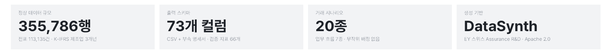</p>
<p align="center"><sub>지표 띠, 07장 상단</sub></p>

<p align="center">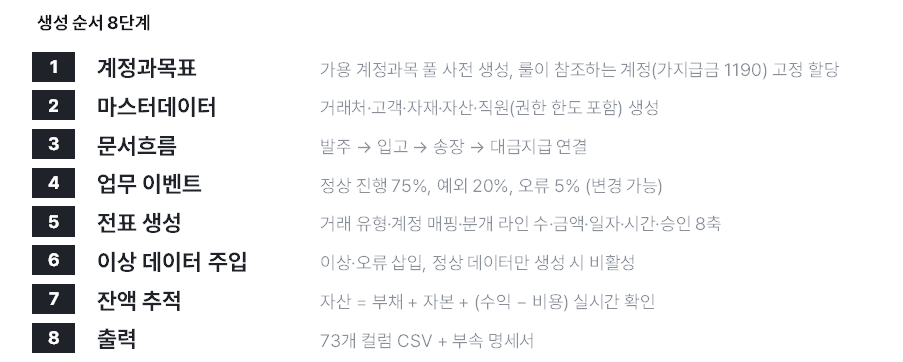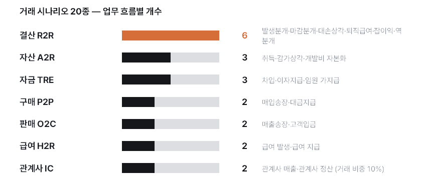</p>
<p align="center"><sub>번호 단계와 값 막대, 07장 본문</sub></p>

<p align="center">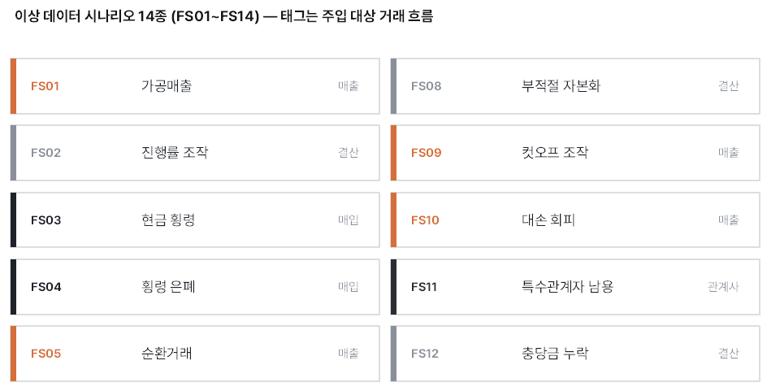</p>
<p align="center"><sub>카드 격자, 08장 좌측</sub></p>

<p align="center">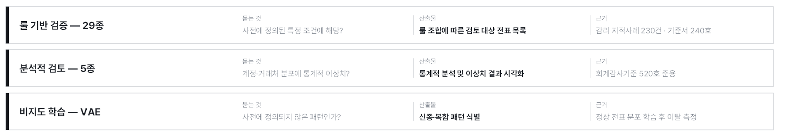</p>
<p align="center"><sub>슬롯 카드, 05장 하단</sub></p>

<p align="center">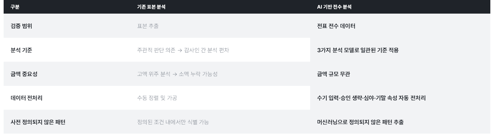</p>
<p align="center"><sub>비교표, 04장 중앙</sub></p>

<p align="center">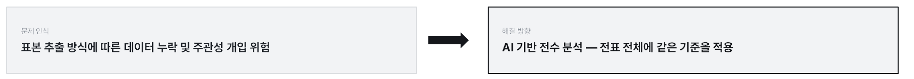</p>
<p align="center"><sub>문제와 해결, 04장 상단</sub></p>

<p align="center">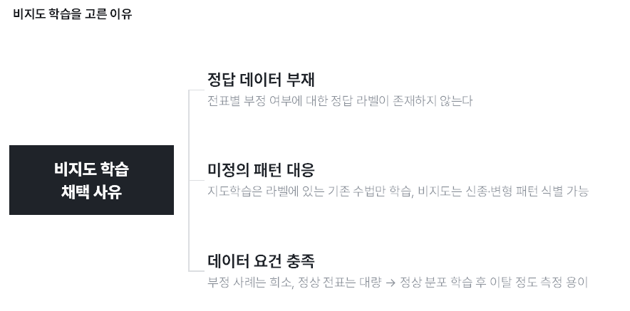</p>
<p align="center"><sub>갈래, 13장 좌측</sub></p>

</details>

---

## 3-3. 기술 설명 - 기계 검사 22종

> **실제 구현**
> - 규격 대조 : [`check_deck.py`](.claude/skills/pptx-build/scripts/check_deck.py)
> - 품질 채점 : [`score_deck.py`](.claude/skills/pptx-build/scripts/score_deck.py)
> - 이미지 출력 : [`render_deck.ps1`](.claude/skills/pptx-build/scripts/render_deck.ps1)

### 규격 정합성 검사

| #   | 검증 항목                 | 탐지 조건                                             |
| --- | ------------------------- | ----------------------------------------------------- |
| 1   | 우측 여백 초과            | 객체가 지정 여백을 침범                               |
| 2   | 하단 여백 초과            | 객체가 하단 영역 침범                                 |
| 3   | 이미지 가시성             | 아이콘보다 크지만 가시성 임계 보다는 작은 크기의 그림 |
| 4   | 헤드라인 계약 일치        | 계약 문구와 생성 문구 일치 여부                       |
| 5   | 정형 페이지 누락          | 표지, 간지 문구가 산출물에 없음                       |
| 6   | 목차 네비게이션 누락      | 계약이 지정한 공간에 표시 도형 0개                    |
| 7   | 목차 네비게이션 강조 개수 | 강조된 목차가 하나가 아님                             |
| 8   | 목차 네비게이션 강조 대상 | 강조된 목차가 그 장에 지정된 목차와 다름              |
| 9   | 표시 문구와 순서          | 계약이 만든 기대 목록과 산출물 목록 전체 비교         |

### 품질 점검

| 점검 묶음       | 탐지 대상                                                                    |
| --------------- | ---------------------------------------------------------------------------- |
| 색과 대비       | 강조색 남용, 명도 이상                                                       |
| 레이아웃과 밀도 | 경계 이탈, 객체 밀도 미달, 할당 면적 대비 적은 내용                          |
| 객체 복잡도     | 밝은 배경 객체 내부에 하위 구조가 존재하지 않는 결함                         |
| 중복성          | 같은 이름에 같은 데이터를 사용한 결함, 같은 이름에 이질 데이터를 사용한 결함 |
| 겹침            | 글자 겹침, 텍스트 겹침, 그림이 글자 침범                                     |

---

## 4. 변동성 검증

### 렌더링 변동성 측정

목업 선택을 생략하고 두 장을 각 3회 생성

| 측정      | 07장 3회              | 10장 3회        |
| --------- | --------------------- | --------------- |
| 도형      | 109\~111, 변동계수 1% | 142\~188, 13%   |
| 시각 요소 | 42\~47, 5%            | 57\~92, **22%** |
| 글자      | 774\~866, 5%          | 648\~852, 11%   |
| 검사      | 3회 전부 결함 0       | 3회 전부 결함 0 |

- 변동성 발생 원인 :데이터의 성격에 기인
  - 원시 자료에 순서와 개수가 정해진 07장은 배치가 일정하게 수렴
  - 순서가 명시되지 않은 10장은 형태가 크게 변동
- 데이터 무결성 : 수치 조작이나 지어낸 내용은 3회 모두 0건

### 실제 스크린샷 (07장 3회)

<p align="center"></p>
<p align="center"><sub>1회차, 8단계를 가로 체인으로 눕히고 이 장에서 안 도는 단계는 회색으로 껐다</sub></p>

<p align="center"></p>
<p align="center"><sub>2회차, 무결성을 가로 4칸으로 펴고 하단에 분개 라인·기표 일자 가중을 막대로 추가</sub></p>

<p align="center"></p>
<p align="center"><sub>3회차, 8단계를 좌측 세로로 세우고 무결성은 하단 흐름도로</sub></p>

---

## 5. 핵심 의사결정

### 5-1. 제약 설정에서 최소 규격 위임으로 전환

- 초기 아키텍처의 목표 : 규격을 강제하여 산출물 통제
- 실측된 현상 : 제약 수준이 높아질수록 오히려 시각적 품질과 정보 전달력이 떨어짐

| 통제 대상   | 기존 설계                                    | 개선 설계                                |
| ----------- | -------------------------------------------- | ---------------------------------------- |
| 설계 방향성 | 규칙, 시각화 부품 확장으로 결과 고정         | 필수 서식 규격만 통제                    |
| 시각화 부품 | 흐름도와 관계도까지 완성형으로 제공          | 완성형 전부 폐지, 사각형과 연결선만 설정 |
| 텍스트 밀도 | 최소 글자 수 하한선 강제                     | 하한 폐지                                |
| 검증        | 시각적/미적 완성도까지 검사(기준이 모호했음) | 구조 이탈 등 물리적 형태만 차단          |

- 기존 설계 실패 예시
  - 글자 수 하한선 설정 : 시각화를 모두 없애고 텍스트로 슬라이드 구성하는 방식으로 퇴화
  - 과도한 제약의 부작용 : 본문 면적의 83\~94%가 의미 없는 회색 덩어리 색칠로 퇴화
- 해결 방안
  - 패러다임 전환 : 통제력 강화 → 최소한의 필수 규격만 정의, 자율성 부여
  - 전환 결과 : 무의미한 텍스트나 색칠 대신 의미있는 콘텐츠로 레이아웃 형성

### 5-2. 콘텐츠 가변성 통제를 위한 인터뷰 도입

- 코드 통제의 한계 : 원천 자료 중 핵심 자료를 고르는건 정답이 없음
- 해결 방안 : 렌더링 진입 전, 사용자와의 구조화된 인터뷰를 통해 목차와 핵심 메시지를 01.5_outline.md 계약 명세로 작성
- 결과 : 자료 밖 제목 **0건**, 같은 계약 3회 반복 생성에서 지어낸 수치 **0건**, 핵심 내용 위주의 슬라이드 생성 성공

---

## 6. 한계

| #   | 한계                   | 상세 내용                                                                                                            |
| --- | ---------------------- | -------------------------------------------------------------------------------------------------------------------- |
| 1   | **환경 종속성**        | 인터뷰 및 생성 절차가 스킬 형태로 구성(클로드 코드 종속), 렌더링을 위해 Windows OS 및 MS PowerPoint 구동 환경이 강제 |
| 2   | **원천 데이터 의존성** | 원천 데이터에 없는 정보는 생성 불가, 원천 자료의 뎁스나 내용 구성에 따라 생성 품질이 달라짐                          |
| 3   | **LLM 생성의 한계**    | LLM의 확률적 특성 - 레이아웃 편차 발생, 서식 규격은 통제되지만 세부 객체 렌더링 형태 동일 재현은 불가능함            |
| 4   | **수동 개입 필수**     | 초기 명세 인터뷰 응답, 목업 이미지 선택, 최종 시각 검수 및 반려 등 사용자 의사결정 개입이 필수적                     |

---

## 7. 기술 스택

| 레이어            | 기술                   | 비고                                                     |
| ----------------- | ---------------------- | -------------------------------------------------------- |
| 런타임            | Python 3.13 고정       | 버전 파일과 프로젝트 설정 양쪽에 선언                    |
| 패키지와 가상환경 | uv, 잠금 파일          | 재현 가능, 별도 활성화 없이 실행                         |
| 생성              | python-pptx            | 슬라이드를 파이썬으로 직접 그림                          |
| 규격 값           | PyYAML                 | 색과 글꼴과 슬라이드 크기와 임계 33개                    |
| 차트              | matplotlib             | 구현 완료, **현재 미배선**                               |
| 렌더              | 파워포인트 COM, 파워셸 | 전역 뮤텍스로 직렬화, 높이는 슬라이드 크기에서 파생      |
| 검사              | lxml                   | 색 읽기는 읽기 전용, 쓰기 접근이 테두리를 만든 사고 이후 |
| 개발              | ruff, pypdfium2        | 줄 길이 100자                                            |

---

## 8. 빠른 실행

```bash
uv sync                                                      # Python 3.13, .venv 생성

uv run python scripts/check_outline.py <계약.md> <자료.md>   
uv run python .claude/skills/pptx-build/scripts/check_deck.py <deck.pptx> --outline=<계약.md>
uv run python .claude/skills/pptx-build/scripts/score_deck.py <deck.pptx>
pwsh .claude/skills/pptx-build/scripts/render_deck.ps1 -Pptx <deck.pptx> -OutDir <폴더>
```

- 렌더는 파워포인트 COM을 쓰므로 윈도우와 파워포인트 설치가 필요
