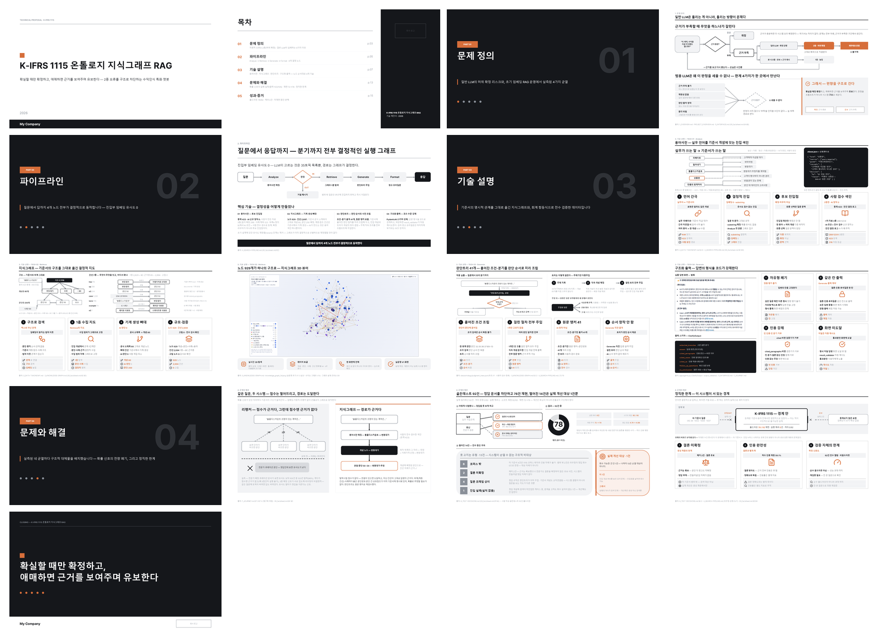
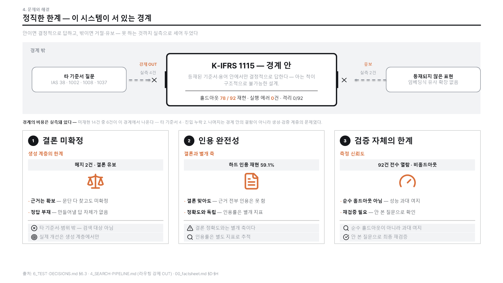
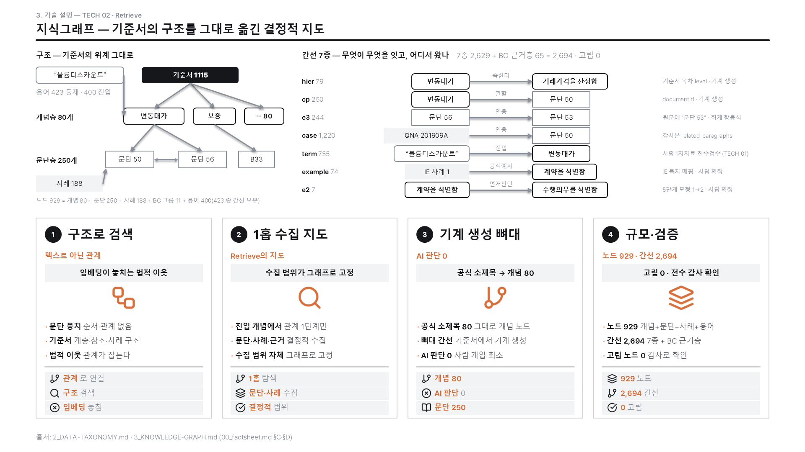
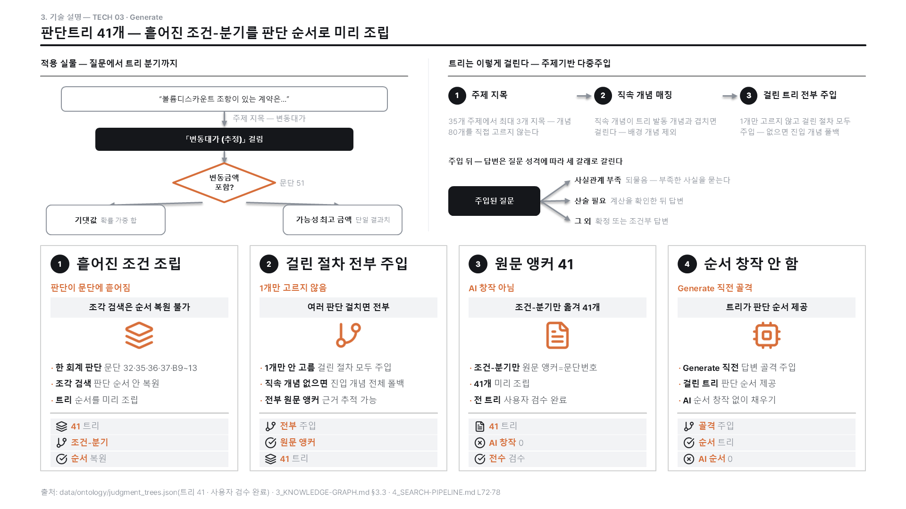
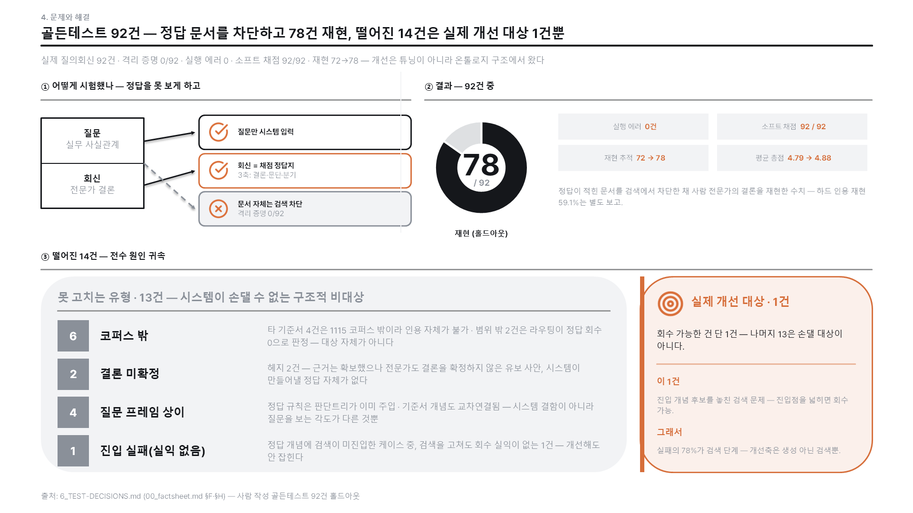

# 골든 덱 기반 B2B 셀링 PPT 서식 공장⚠️readme 수정 진행 중 (현재 초안 readme)

> 프로젝트 정리본(`FINAL-REPORT/` 보고서 묶음)을 재료로, 일관 서식의 **네이티브 .pptx**를 찍어내는 도구 — 그리고 덱을 만들/수정하며 드러난 결함을 하네스에 내려 **공장 자체를 벼리는 사용자 조종 루프**

---

## 개요

손으로 깎아 박제한 **골든 덱 17장**을 기준선으로 두고, 그 서식·밀도를 기계 게이트로 강제하는 PPT 공장.

그리고 이 프로젝트의 정체는 공장을 **벼리는 루프**다 — 골든이든 실전 덱이든 만들거나 **수정**할 때마다 드러난 버그·배선 공백·부품 부재를 **배치 판단(부품>게이트>배선>훅>prose)**으로 재발 안 하는 자리에 내려 다음 덱이 상속하게 한다. 이 루프의 1급 객체가 **`deck-smith` 에이전트**. 정체·원칙은 [FINAL-REPORT/1_OVERVIEW.md](FINAL-REPORT/1_OVERVIEW.md) §0.

1. Grill    : 목차·콘텐츠 인터뷰로 계약 확정 (사용자 육성 채록)
2. Compose  : 정리본에서 선별·배치 — 골든 매칭 3갈래 판정
3. Build    : 네이티브 .pptx 렌더 (표·차트가 편집 가능한 개체)
4. Verify   : 계약 대조 · 오딧 · 회귀 3층 게이트

```
   <프로젝트>/FINAL-REPORT/   (보고서형 md 묶음 — 사용자가 미리 정리)
       │
       ▼
 ━━━ 네 단계 모두 골든 덱 17장을 기준선으로 참조 ━━━━━━━━━━━━━━━━━━━━━━━━━━

    ① 인터뷰   ───▶   ② 구성    ───▶   ③ 빌드     ───▶   ④ 검증
    목차 계약        선별·배치        네이티브 렌더      계약 대조·오딧
    육성 채록        매칭 3갈래       골든 부품 조립     회귀 대조
    확정 전 정지     본문 장당 3안    글 유출 시 중단    FAIL이면 되돌림

 ━━━━━━━━━━━━━━━━━━━━━━━━━━━━━━━━━━━━━━━━━━━━━━━━━━━━━━━━━━━━━━━━━━━━━━
                         │
                         ▼
                  결정론 빌드 — 같은 계약·같은 브랜드킷이면 같은 덱

```

**실제 골든 덱 17장 (5부 구성)**



<sub>운영 골든덱(`golden/build_operating.py` 조립분 — 프레임 + 고밀도 본문 9장). 검은 간지 4장이 부를 나눈다. 회귀 기준선인 sparse 골든 17장과는 별개로 dense 본문을 조립한 운영본이며, 레지스트리 승격(회귀 하네스 재조정)은 진행 예정이다.</sub>

---

## 1. 문제 인식

### 착안

LG생활건강에서 보고서와 발표자료를 만들며 겪은 어려움에서 출발했다. 서식 작업은 매번 처음부터였고, 만든 자료도 품질이 사람과 시점에 따라 흔들렸다.

### 범용 LLM으로 찍어낼 때의 한계

| 구분      | GPT 등으로 찍어낸 자료          | 본 도구                                    |
| --------- | ------------------------------- | ------------------------------------------ |
| 수정 가능 | 이미지로 굳어 안의 내용 못 고침 | 네이티브 개체 — 표·차트 값 직접 편집       |
| 차트      | 그림이라 수치 변경 불가         | python-pptx 차트 — 데이터 시트가 살아 있음 |
| AI 티     | 문장·배치에 티가 많이 남        | 골든 덱 문장·밀도를 기준선으로 강제        |
| 재현성    | 같은 요청에 매번 다른 결과      | 같은 계약 = 같은 덱                        |

핵심은 **"받은 뒤에 고칠 수 있는가"**다. 이미지로 굳은 슬라이드는 숫자 하나 바꾸려 해도 처음부터 다시 만들어야 한다.

---

## 2. 실증 예시 — 한 장이 벼려지는 과정

> 아래는 **골든 덱을 만들며 공장 자체가 벼려지는 과정**이다(정체 §0의 루프 실증). 실제 프로젝트 덱을 뽑으면 그 사례로 대체할 예정이다.

골든 S16(경계) 한 장을 고밀도로 재작업하다, 그 과정에서 새 게이트 하나가 태어난 실화를 따라간다.

```
━━━ S16 한 장이 §8 게이트를 낳기까지 ━━━━━━━━━━━━━━━━━━━━━━━━━━━━━━━━━━

  ◆ 시안       하단 한계 3장을 손으로 그림 — 번호 + 제목 + 회색 텍스트
                     │
                     ▼
  ◆ 반려       "밋밋하고 쓰레기" — 글자수·채움률·넘침 게이트는 전부 green인데 눈으로는 밋밋
                     │
                     ▼
  ◆ 원인       "카드 = hero_card 단일"(리치 컴포넌트)이 규칙·부품으로 있었으나
                     │            **기계 강제가 없어** 즉흥 밋밋 카드가 통과됐다
                     ▼
  ◆ 배치       check_adhoc_card 신설(카드 크기 밝은 박스에 구조 자식 0 = FAIL)
                     │            통과작 8장 오탐 0 검증 → 정본 게이트에 배선(전 경로 강제)
                     ▼
  ◆ 재건       hero_card로 다시 조립 → 게이트 통과. 이제 밋밋 카드는 preflight에서 막힌다
                     └─ 발견이 코드로 내려가 다음 덱이 상속한다("채점자는 광산이다")

```

결과가 아래 슬라이드다. 상단 경계 도해(밖 → 차단벽 → 안), 하단 hero_card 3장(배지·아이콘·배너·불릿·칩)이 한 장에 들어간다.



<sub>이 장을 밋밋하게 만들려던 시도가 §8 즉흥 카드 게이트를 낳았다 — 이것이 이 프로젝트의 정체(공장을 벼리는 루프)이자 `deck-smith` 에이전트가 하는 일이다.</sub>

---

## 3. 기술 설명 ① 골든 덱 — 기준선을 먼저 박제한다

규칙을 쌓아 품질을 만들려던 방식을 버리고, **완성된 한 벌을 먼저 만들어 기준으로 삼는** 방식으로 갔다. 뒤의 구성·빌드 단계는 전부 이 기준선을 참조한다.

### 구성

| 무엇          | 개수 | 쉬운 뜻                                                 |
| ------------- | ---- | ------------------------------------------------------- |
| 부            | 5    | 문제 정의 · 파이프라인 · 기술 설명 · 문제와 해결 · 성과 |
| 슬라이드      | 17   | 표지 1 · 목차 1 · 간지 4 · 본문 11                      |
| 도형 총계     | 519  | 스냅샷에 좌표·색·글자까지 기록                          |
| 레이아웃 부품 | 15   | 실전 덱이 이름으로 꺼내 쓰는 장 유형                    |

장마다 도형 수가 다르다. 표지 8 · 간지 11 · 스크린샷 21 · 실행 그래프 43 · 지식그래프 80. **밀도 자체가 장 유형의 정의**다.

### 골든은 복제 템플릿이 아니다

내용이 골든과 안 맞는데 억지로 끼워 넣으면 "텍스트만 갈아 끼운 덱"이 나온다. 출발점을 셋으로 나눈 이유다.

```
  실전 장의 내용을 골든 15종과 대조
       │
       ├─ 구조가 맞음        ──▶  골든 부품 그대로 + 내용 전량 교체
       │
       ├─ 구획·항목이 다름   ──▶  그 장만의 스크립트로 변형
       │
       └─ 맞는 부품 없음     ──▶  새로 그리되 골든의 밀도를 기준으로
```

세 갈래 모두 골든을 참조한다. 변형 폭만 다르다.

---

## 4. 기술 설명 ② 인터뷰 계약 — 만들기 전에 묻는다

"그냥 찍어내줘"로 시작하면 목차부터 어긋난다. 그래서 생성 전에 사용자와 목차·내용을 확정하는 단계를 앞에 세웠다.

```
━━━ ① 인터뷰 — 계약이 만들어지는 곳 ━━━━━━━━━━━━━━━━━━━━━━━━━━━━━━━━━

  ◆ 먼저 제시     빈 종이에서 묻지 않는다 — 목차 1안을 만들어 놓고 시작
                       │
                       ▼
  ◆ 부·장 단위 채록    "이 장에서 가장 전하고 싶은 것" 육성 그대로 받아 적음
                       │             (요약·윤색 금지 — 다듬기는 나중 단계)
                       ▼
  ◆ 재료 확정     확정 이미지 · 앵커 수치 · 강조점을 계약에 박음
                       │
                       ▼
  ◆ 정지선        전 장 "확정" 전에는 다음 단계로 못 넘어감
                       │
                       ▼
                 계약 파일 — 이후 모든 단계가 이걸 본다

```

이 계약은 ④ 검증에서 **정답지 노릇**을 한다.

- 계약이 확정 이미지 3종을 지정했다면 → 그 이미지가 없는 덱은 아무리 예뻐도 실패
- 계약이 없으면 애초에 내릴 수 없는 판정

---

## 5. 기술 설명 ③ 구성 — 창작이 아니라 선별·배치

정리본에 없는 수치·성과는 만들지 않는다. 이 단계는 재료를 골라 어느 장에 어떤 골격으로 앉힐지만 정한다.

### 매칭 결정

각 장의 물성(비교인가 · 흐름인가 · 분해인가 · 실물 화면인가)을 골든 15종과 대조해 출발점을 정한다. **내용이 형태를 정하지, 형태에 내용을 맞추지 않는다.**

### 내용 주입 강제

골든 부품을 쓸 때는 그 부품이 요구하는 칸을 전부 채워야 한다. 10개 레이아웃에 걸쳐 필수 항목 150개가 계약표로 박혀 있다.

| 상태               | 결과                                       |
| ------------------ | ------------------------------------------ |
| 칸을 전부 채움     | 정상 렌더                                  |
| 칸이 비었거나 없음 | 빌드 즉시 중단                             |
| 키만 있고 값이 빔  | 빌드 즉시 중단 — "키 존재는 주입이 아니다" |

빈 칸을 골든 기본값으로 조용히 메우면 **다른 프로젝트의 문장이 실전 덱에 섞여 나간다**. 실제로 그 사고가 있었고(9장), 그 뒤로 중단 규칙을 넣었다.

### 목업 승인

본문 장마다 서로 다른 유형 3안을 실물로 렌더해 갤러리로 보여주고, 사용자가 고른 뒤에야 구성이 확정된다. 구성 반려를 빌드 후가 아니라 텍스트 단계에서 끝내려는 장치다.

---

## 6. 기술 설명 ④ 빌드 — 네이티브 개체로 조립

받은 사람이 PowerPoint에서 직접 고칠 수 있어야 한다. 이미지가 아니라 도형·표·차트 개체로 만드는 이유다.

### 타입 라우팅

```
  구성 결과의 장 유형
       │
       ├─ 기본 유형 11종        ──▶  마스터 틀 자동 스탬프
       │   (표지·목차·본문·차트·표·인용·마무리 등)
       │
       ├─ 골든 부품 15종        ──▶  부품 창고에서 꺼내 조립
       │                              └─ 내용 전량 주입 확인 후 렌더
       │
       └─ 변형·신규            ──▶  그 장 전용 스크립트 실행
```

### 서식 단일 출처

색·폰트·크기는 브랜드킷 파일 하나에만 있다. 코드 9곳이 전부 이 파일에서 값을 받아 가므로, **파일 하나를 고치면 전 덱에 반영**된다.

| 무엇      | 개수 | 내용                         |
| --------- | ---- | ---------------------------- |
| 색        | 6    | 무채색 기반 + 강조색 1종     |
| 폰트      | 3    | 제목 · 본문 · 캡션           |
| 크기 단계 | 8    | 표지 40 부터 각주 8 까지     |
| 서식 규칙 | 126  | 전역 · 장 유형별 · 제작 절차 |

밀도 기준은 컨설팅 리포트 111장을 실측해 잡았다. 장당 120~200단어, 중앙값 197.

### 시각 어휘

| 유형             | 개수 | 편집 가능 여부            |
| ---------------- | ---- | ------------------------- |
| 네이티브 차트    | 6    | 가능 — 데이터 시트 내장   |
| 도형 다이어그램  | 18   | 가능 — 도형 개체          |
| 통계 그래프      | 9    | 이미지 (워터폴·히트맵 등) |
| 아이콘           | 24종 | 3색 변형 = 72장           |
| 장 유형 카탈로그 | 38   | 렌더러 실존 확인된 것만   |

카탈로그에는 **실제로 그릴 수 있는 것만** 올린다. 그리지 못하는 형식을 결정표에 올려두면 빌드가 불가능한 구성이 나온다.



<sub>도형 80개로 가장 촘촘한 장. 왼쪽 관계 도해와 오른쪽 3D 뷰어 화면이 한 장에 들어간다.</sub>



<sub>같은 덱 안에서도 장마다 시각 문법이 달라진다 — 이 장은 분기 트리, 앞 장은 관계 그래프.</sub>



<sub>가운데 링도넛(78/92)은 이미지가 아니라 **네이티브 차트**(python-pptx 도넛) — 데이터 값을 바꾸면 링이 다시 그려진다. 오른쪽은 떨어진 14건을 못 고침 13 대 실익 1로 비대칭 해부.</sub>

---

## 7. 기술 설명 ⑤ 게이트 — 통과 못 하면 안 나간다

"빌드됐다"와 "계약대로다"는 다르다. 세 층이 서로 다른 것을 본다.

```
━━━ 게이트 3층 ━━━━━━━━━━━━━━━━━━━━━━━━━━━━━━━━━━━━━━━━━━━━━━━━━━━━━

  ◆ 빌드 중        내용 주입 확인
      골든 부품의 빈 칸  ──▶  즉시 중단 (골든 문장 유출 차단)

  ◆ 빌드 후        완성된 덱 검사
      계약 대조 6종      ──▶  장 수 · 제목 · 골든 오염 · 확정 이미지
                              · 금지어 · 앵커 수치
      덱 오딧 9항목      ──▶  밀도 밴드 · 정렬 · 여백 · 빈 상자 · 즉흥 밋밋 카드(§8)
      브랜드 검사 13항   ──▶  색 · 폰트 · 네이티브 표/차트 · 시각 다양성 4종

  ◆ 골든 보호      기준선이 안 변했는지
      회귀 대조         ──▶  17장 519도형을 좌표·색·글자까지 전수 비교
      검사기 자체 시험   ──▶  일부러 결함을 심어 11가지 케이스가 잡히는지

```

**계약 대조가 실패하면 나머지가 전부 통과여도 판정은 실패**다. 정답은 골든 기본값도 팩트시트도 아니고 사용자와 확정한 계약이기 때문이다.

마지막 층인 "검사기 자체 시험"이 필요한 이유는 단순하다 — **항상 통과를 내는 검사기도 통과율 100%를 만든다.** 그래서 검사기에 일부러 결함을 심어 잡히는지를 따로 확인한다.

게이트는 고정된 목록이 아니라 **루프의 산물**이다. 덱을 만들다 눈으로만 잡히던 결함(예: 밋밋한 카드)이 나오면, 그걸 검출하는 규칙을 정본 게이트(`generic_checks`)에 내리고 통과작 전수로 오탐 0을 확인한 뒤 배선한다 — 그러면 preflight·빌드·QA·종료 훅이 전부 그 하나를 물어 전 경로에서 강제된다. §8(즉흥 밋밋 카드)이 그렇게 태어났고, 렌더 눈검증을 건너뛴 완료 선언은 종료 훅(렌더 게이트)이 막는다.

---

## 8. 검증

골든 덱과 게이트 자체는 실측했으나, **실제 프로젝트를 끝까지 찍어낸 검증은 아직 없다.** 실전 덱을 뽑은 뒤 이 절을 채울 예정이다.

현재까지 확인된 것만 적는다.

| 항목             | 결과                       |
| ---------------- | -------------------------- |
| 골든 회귀 대조   | 17/17장 · 519/519도형 일치 |
| 검사기 자기 시험 | 11/11 케이스 검출          |
| 강조색 변조 실험 | 색 한 값 바꾸자 55건 검출  |
| 좌표 변조 실험   | 0.01인치 밀자 197건 검출   |

변조 실험은 "게이트가 실제로 무엇을 보는가"를 확인했다. 색 서명을 넣기 전에는 같은 변조에 0건이었다 — 게이트가 색에는 장님이었다는 뜻이다.

---

## 9. 핵심 의사결정

### 1. 재료 생산을 외부 도구에 맡기려다 되돌림

초기에는 NotebookLM으로 초안을 여러 개 만들어 통합하는 전반부를 두었다.

- 그런데 사용자가 프로젝트별 정리본을 이미 유지하고 있었다
- 정리본에서 다시 보고서를 뽑는 중복 구조였음
- 전반부를 통째로 걷어내고 정리본을 단일 재료로 확정

**얻은 것** — 단계가 줄었고, 재료의 출처가 하나로 고정돼 수치를 대조할 수 있게 됐다.

### 2. "그냥 찍어내줘"의 한계 — 인터뷰 게이트 신설

처음에는 정리본을 주면 알아서 찍어내는 구조였다. 목차가 어긋나고, 강조하고 싶은 것이 빠지고, 완성 후에야 그걸 발견했다.

```
  [이전]  정리본 ──▶ 생성 ──▶ 완성본 보고 반려 ──▶ 다시 생성
                                     └─ 반려 비용이 빌드 뒤에 발생

  [이후]  정리본 ──▶ 인터뷰 계약 ──▶ 생성 ──▶ 완성
                        └─ 반려를 텍스트 단계로 앞당김
```

목차·콘텐츠 인터뷰 단계를 별도 스킬로 만들어 파이프라인 맨 앞에 세웠다. 계약이 생기면서 **검증에 정답지가 생겼다**는 것이 더 큰 소득이었다.

### 3. 목업으로 품질을 높이려다 실패 — 골든 덱으로 전환

선택지를 많이 보여주면 좋은 것이 골라질 거라 보고, 목업 갤러리와 다양성 규칙을 붙였다. 실패했다.

- 컨설팅 리포트 184쪽과 실제 덱을 육안 대조 — 갭 7개 확인
- 그중 규칙으로 고칠 수 있는 것은 3개뿐이었음
- 형식은 다양해졌는데 여전히 없어 보였음

| 접근            | 수렴점                           |
| --------------- | -------------------------------- |
| 규칙을 쌓는다   | 없음 — 규칙을 통과하는 평범한 덱 |
| 기준선을 만든다 | 있음 — "저것과 같은가"로 판정    |

**규칙은 나쁜 것을 막을 수 있어도 좋은 것을 만들지는 못한다.** 그래서 완성된 한 벌(골든 덱)을 손으로 깎아 기준으로 삼는 쪽으로 갔다. 목업 갤러리는 없애지 않고 **사용자 승인 게이트로 남겼다** — 선택지를 고르는 용도로는 여전히 쓸모가 있다.

### 4. 찍어내는 공장에서, 공장을 벼리는 루프로 — 정체 재정의

골든이든 실전 덱이든 만들거나 **수정**할 때마다 결함이 드러난다. 그 발견을 코드로 내려 다음 덱이 상속하게 하는 것이 이 프로젝트의 정체임을 뒤늦게 명시했다(정체 §0).

- **계기** — S16 한계 카드가 밋밋하게 반복 반려. 리치 컴포넌트(`hero_card`)와 "카드=hero_card 단일" 규칙이 있었으나 **기계 강제가 없어** 손으로 그린 밋밋 카드가 전 게이트를 통과했다.
- **배치 판단** — 국소 스킬에 패치를 덧대지 않는다. **부품 > 게이트 > 배선 > 훅 > prose** 사다리로 재발이 멈추는 자리를 고른다(단일 출처·오탐 0·래칫).
- **결과** — `check_adhoc_card`(§8)를 정본 게이트에 배선 + 이 루프를 수행하는 **`deck-smith` 에이전트** 신설.

| 접근           | 한계                                                      |
| -------------- | --------------------------------------------------------- |
| 규칙(prose)    | 잊히고 무시된다 — "카드=hero_card"가 그렇게 반복 무시됐다 |
| 부품·게이트·훅 | 강제되지만 **배선**이 없으면 존재≠검사(hollow)가 된다     |

**어느 층이든 배선 없이는 무시된다** — 이 프로젝트가 반복 학습한 실패 경로다.

---

## 10. 한계

이 프로젝트는 **미완성**이다.

| #   | 한계                  | 상태                                                                                             |
| --- | --------------------- | ------------------------------------------------------------------------------------------------ |
| 1   | 실전 완주 사례 0건    | 산출 폴더의 빌드 4건은 모두 게이트 미통과분                                                      |
| 2   | 첫 파일럿 동결        | 계약 위반 17건 판정 후 재빌드 기록 없음                                                          |
| 3   | 골든 오딧 커버리지    | 레이아웃 15종 중 7종만 정밀 검사 등록                                                            |
| 4   | 골든 내부 수치 불일치 | 같은 수치가 한 장은 정정값, 두 장은 폐기값 (미해결)                                              |
| 5   | 폰트 이름 미검사      | 회귀 대조가 크기·볼드만 보고 서체 이름은 안 봄                                                   |
| 6   | 일부 문서 스테일      | OVERVIEW·README·트러블슈팅은 갱신(2026-07-21) · 나머지 FINAL-REPORT 장은 구 서술 잔존            |
| 7   | 게이트 수동 실행      | 자동 후크가 아니어서 건너뛰면 없는 게이트가 됨                                                   |
| 8   | 증거 재현 불가        | 레퍼런스·산출물이 형상관리 제외라 클론에 없음                                                    |
| 9   | dense 개편 진행 중    | 운영 골든덱은 dense 조립본 · 레지스트리 승격(회귀 하네스 재조정)·exec_graph(S6)·S14 dense는 미완 |

4번은 이 문서를 만드는 과정에서 발견했다. 골든 덱 안에서 같은 수치가 두 값으로 갈리는데, 위 2장 이미지에도 그대로 보인다.

---

## 11. 기술 스택

| 레이어      | 기술           | 비고                              |
| ----------- | -------------- | --------------------------------- |
| 언어        | Python 3.13    | 버전 고정                         |
| 문서 생성   | python-pptx    | 네이티브 개체 — 표·차트 편집 가능 |
| 설정        | PyYAML         | 브랜드킷 단일 출처                |
| 통계 그래프 | matplotlib     | 워터폴·히트맵 등 9종              |
| 환경        | uv             | 잠금 파일로 재현 가능             |
| 렌더 검증   | PowerPoint COM | 실물 렌더 후 눈 검증              |

---
